# Development Guide

## Index

- [Introduction](#introduction-to-development-guide)
- [Technologies](#technologies)
- [Tools](#tools)
- [Architecture](#architecture)
- [Quality Assurance](#quality-assurance)
- [Development Process](#development-process)
- [Code Execution and editing](#code-execution-and-editing)


##  Introduction to development guide

The developed application is a monolithic web application with a Single Page Application architecture. In this type of architecture, all user interaction happens within a single HTML page, while interface updates and navigation logic are handled dynamically on the client without reloading the entire page.

In this project:
- The frontend is implemented with React and TypeScript, using Vite as the build tool and development server. 
- The backend is developed in ASP.NET Core (C#), providing a REST API that handles CRUD (Create, Read, Update, Delete) operations. 
- Data persistence is handled with MySQL, currently in a local environment.

The backend follows a layered structure:
- **Controllers:** receive HTTP requests from the client. 
- **Business Logic Layer (BLL):** applies business rules and operations. 
- **Data Access Layer (DAL):** manages interaction with the database.

Deployment is not yet configured but is planned for Microsoft Azure. 

Development follows an iterative and incremental approach, based on agile principles, with continuous integration and automated quality controls.


### Technical Summary

- **Type:**  
  Web SPA + REST API, monolithic solution with a clear client-server separation.

- **Technologies:**  
  - **Languages:** TypeScript, HTML, CSS, C#, SQL.  
  - **Frontend:** React, React DOM, Axios, Vite, @vitejs/plugin-react ,Bootstrap 
  - **Backend:** ASP.NET Core, ADO.NET AutoMapper, Newtonsoft.Json, Swashbuckle.AspNetCore (Swagger/OpenAPI), Microsoft.Extensions.Logging, Microsoft.AspNetCore.Identity.  
  - **Database:** MySQL.  
  - **Testing (Frontend):** Vitest, @vitest/ui, @testing-library/react, @testing-library/jest-dom, @testing-library/user-event, jsdom, @playwright/test.  
  - **Testing (Backend):** xUnit, Moq, Microsoft.AspNetCore.Mvc.Testing, Microsoft.AspNetCore.TestHost, CoverletCollector, Microsoft.NET.Test.Sdk.

- **Tools:**  
  - **IDEs:** Visual Studio (primary), Visual Studio Code (secondary).  
  - **Version control:** Git (GitHub as remote repository).  
  - **Branch management:** SourceTree.  
  - **Database:** MySQL Workbench.  
  - **Auxiliar:** Postman/Swagger (for API testing), ESLint & SonarQube(SonarLint) (static code analysis on client), .

- **Quality Assurance:**  
  - Unit, integration and E2E tests both on client and server.
  - Code coverage and automatic validation through CI/CD flows (GitHub Actions).  
  - Static analysis with SonarQube and code reviews in pull requests.

- **Deployment:**  
  - Current stage: local execution and docker deploy.
  - Planned deployment: cloud environment **Microsoft Azure**.
  - Packing via Docker (containers for frontend, backend and database).

- **Development Process:**  
  - Iterative and incremental approach.  
  - Versioning with Git and repository on GitHub.
  - Task management using GitHub Issues and Projects (Kanban-style boards).
  - **Continuous integration (CI/CD)**:  
    - *Basic pipeline*: run on pushes to feature branches, compiles and runs unit tests.  
    - *Full pipeline*: run on merges to develop or main, includes compilation, unit tests, integration tests and system tests (E2E).


## Technologies

This section describes the **technologies used to execute the application**, both on the client and server sides, as well as the database and deployment environment.  

### Frontend

The client layer is developed as a **Single Page Application (SPA)** using **React** with **TypeScript**, served and bundled with **Vite**.  
These technologies enable a dynamic, modular, and efficient user interface.

- **React**: Main library for building component-based user interfaces.  
  - [https://react.dev/](https://react.dev/)

- **TypeScript**: A typed language of JavaScript that improves maintainability.  
  - [https://www.typescriptlang.org/](https://www.typescriptlang.org/)

- **Vite**: A development server optimized for React projects.  
  - [https://vitejs.dev/](https://vitejs.dev/)

- **Axios**: HTTP client used to handle requests between the frontend and the backend API.  
  - [https://axios-http.com/](https://axios-http.com/)

- **Bootstrap**: A library for building responsive and mobile-first websites using pre-designed components and utility classes.
  - [https://getbootstrap.com/](https://getbootstrap.com/)

**Frontend Testing**

The frontend environment includes several testing tools for different levels of automation:

- **Vitest**: Primary testing framework used to execute unit tests in Vite environments.  
  - [https://vitest.dev/](https://vitest.dev/)
  - Also provides a UI for visually exploring and running tests.

- **Testing Library (React)**: The libraries `@testing-library/react`, `@testing-library/jest-dom`, and `@testing-library/user-event` are used to validate UI behavior and component rendering.  
  - [https://testing-library.com/docs/react-testing-library/intro/](https://testing-library.com/docs/react-testing-library/intro/)

- **Playwright**: Framework for **E2E (end-to-end)** testing that automates browsers to validate complete user flows.  
  - [https://playwright.dev/](https://playwright.dev/)
  - Offers a graphical test runner for inspecting and debugging test execution.


### Backend

The server is developed with **ASP.NET Core 8.0** using **C#**, following a layered architecture (Controller : Business Logic : Data Access) and exposing a **REST API** for communication with the frontend.

- **.NET 8 (ASP.NET Core)** : A cross-platform, high-performance backend framework for web and API development.  
  - [https://dotnet.microsoft.com/](https://dotnet.microsoft.com/)

- **AutoMapper** : Library used to automatically map between class objects, speeding up development by simplifying data transformations between layers within the server.  
  - [https://automapper.org/](https://automapper.org/)

- **Newtonsoft.Json** : Library for advanced JSON serialization and deserialization.  
  - [https://www.newtonsoft.com/json](https://www.newtonsoft.com/json)

- **Swashbuckle.AspNetCore / OpenAPI** : Generates OpenAPI/Swagger documentation for the REST API.  
  - [https://github.com/domaindrivendev/Swashbuckle.AspNetCore](https://github.com/domaindrivendev/Swashbuckle.AspNetCore)

- **Microsoft.Extensions.Configuration / Logging** : Handles configuration management and application logging during runtime.  
  - [https://learn.microsoft.com/en-us/dotnet/core/extensions/configuration](https://learn.microsoft.com/en-us/dotnet/core/extensions/configuration)
    
- **ADO.NET** : .NET framework components for connecting to data sources and executing SQL queries or stored procedures. Normally used for SQL Server connections, but it can also be used with MySQL via the appropriate MySQL connector
  - [https://learn.microsoft.com/en-us/dotnet/framework/data/adonet/](https://learn.microsoft.com/en-us/dotnet/framework/data/adonet/)

- **JWT (JSON Web Tokens)** : Used for secure authentication and authorization. JWT ensures that user identity and permissions are validated on every request, enabling controlled access to group‑based resources.
   - https://jwt.io/

- **AWS SDK for .NET (Amazon S3) **: Integrated to manage cloud storage of images (e.g., printer photos). The backend uploads, retrieves and manages files in an S3 bucket, enabling scalable and reliable media storage.
   - https://aws.amazon.com/sdk-for-net/ (aws.amazon.com in Bing)

- **SonarQube (NuGet integration)** : Static code analysis is performed using SonarQube through its .NET NuGet package, ensuring code quality, detecting vulnerabilities, and enforcing clean‑code practices during development.
   - https://www.sonarsource.com/products/sonarqube/
     
**Backend Testing**

The backend includes multiple frameworks and tools for automated unit and integration testing:

- **xUnit** : Unit testing framework for .NET applications.  
  - [https://xunit.net/](https://xunit.net/)

- **Moq** : Library for creating mock objects during testing.  
  - [https://github.com/moq/moq4](https://github.com/moq/moq4)

- **Microsoft.AspNetCore.Mvc.Testing** and **TestHost** : Used to perform integration tests on ASP.NET Core applications.  
  - [https://learn.microsoft.com/en-us/dotnet/api/microsoft.aspnetcore.mvc.testing](https://learn.microsoft.com/en-us/dotnet/api/microsoft.aspnetcore.mvc.testing)

- **CoverletCollector** : Tool used for collecting and reporting code coverage metrics.  
  - [https://github.com/coverlet-coverage/coverlet](https://github.com/coverlet-coverage/coverlet)
  - Note: This tool has not been fully tested due to the initially limited number of tests.
    
### Database

The project uses a **MySQL** database running locally during development.  
The backend connects via a **connection string** defined in the configuration file, using stored procedures and database access through **ADO.NET**.

- **MySQL** : Open-source relational database management system.  
  - [https://www.mysql.com/](https://www.mysql.com/)

### Deployment Environment

The application is planned to be deployed to the **Microsoft Azure** cloud environment.  
In future stages, **Docker** containers will be used to encapsulate the frontend, backend, and database services, enabling consistent and portable deployments.

- **Microsoft Azure** : Cloud platform for hosting web applications, databases, and backend services.  
  - [https://azure.microsoft.com/](https://azure.microsoft.com/)

- **Docker** : Containerization platform that packages the application and its dependencies into isolated units for reproducible deployment.  
  - [https://www.docker.com/](https://www.docker.com/)


## Tools

This section describes the **development tools and auxiliary software** used during the creation of the application.  
These tools are distinct from the runtime technologies covered in the previous section.


### Integrated Development Environments (IDEs)

- **Visual Studio** : Main IDE used for developing the backend in ASP.NET Core and C# and the frontend in React with typescript. Provides full debugging, project management, and integration with GitHub. It also allows you to use a template to generate the React + ASP.NET Core project, and simplifies managing NuGet packages to easily add additional functionality.  
  - [https://visualstudio.microsoft.com/](https://visualstudio.microsoft.com/)

- **Visual Studio Code** : Lightweight editor used as a secondary tool to edit singular files or small adjustments.  
  - [https://code.visualstudio.com/](https://code.visualstudio.com/)


### Version Control & Task Management

- **Git** : Version control system used to track changes in both frontend and backend code.  
  - [https://git-scm.com/](https://git-scm.com/)

- **GitHub** : Remote repository for code storage, collaboration, and CI/CD workflows.  
  - [https://github.com/](https://github.com/)

- **SourceTree** : Git client for managing branches, commits, and visualizing repository history.  
  - [https://www.sourcetreeapp.com/](https://www.sourcetreeapp.com/)

- **GitHub Issues & Projects** : Task tracking and visual board (Kanban) used to manage features, bugs, and development progress.  
  - [https://docs.github.com/en/issues](https://docs.github.com/en/issues)


### Database Management

- **MySQL Workbench** : Visual database design, query execution, and schema management tool used during development.  
  - [https://www.mysql.com/products/workbench/](https://www.mysql.com/products/workbench/)


### Code Quality & Static Analysis

> Not fully tested yet

- **ESLint** : Static code analysis tool for JavaScript and TypeScript. Helps enforce coding standards and catch potential errors early.  
  - [https://eslint.org/](https://eslint.org/)

- **TypeScript ESLint** : Integrates TypeScript type checking with ESLint rules.  
  - [https://typescript-eslint.io/](https://typescript-eslint.io/)
    
- **SonarQube + SonarLint (Visual Studio Extension)** : Provides live static code analysis within Visual Studio for backend projects. Highlights code smells, potential bugs, and maintainability issues. 
  - [https://www.sonarqube.org/](https://www.sonarqube.org/)
  - [https://www.sonarlint.org/visualstudio/](https://www.sonarlint.org/visualstudio/)

### Testing Tools

- **Postman** : Tool for testing and interacting with the backend API. Used to send requests, inspect responses, and maintain a collection of API test examples.  
   - [https://www.postman.com/](https://www.postman.com/)

- **Playwright** : Used for end-to-end testing of the frontend by simulating user interaction in real browsers.  
   - [https://playwright.dev/](https://playwright.dev/)

- **Vitest** and **Testing Library (React)** : Tools for unit and component testing in the frontend.  
   - [https://vitest.dev/](https://vitest.dev/)  
   - [https://testing-library.com/docs/react-testing-library/intro/](https://testing-library.com/docs/react-testing-library/intro/)

- **xUnit, Moq, TestHost**: Tools for unit, integration, and code coverage testing in the backend.  
   - [https://xunit.net/](https://xunit.net/)  
   - [https://github.com/moq/moq4](https://github.com/moq/moq4)  
   - [https://learn.microsoft.com/en-us/dotnet/api/microsoft.aspnetcore.mvc.testing](https://learn.microsoft.com/en-us/dotnet/api/microsoft.aspnetcore.mvc.testing)  


## Architecture

This section describes the **deployment architecture** of the project and the **structure of the REST API** exposed by the backend.
### Deployment Architecture

The system is structured as a **monolithic Single Page Application (SPA)** consisting of three main components:  
the frontend, backend, and database. Each component runs as an independent process and communicates using well-defined protocols.


1. **Frontend (Client)**
   - Developed with **React**, **TypeScript**, and **Vite**.
   - Structured into services (for communicating with the API), models (data structures), and components (rendered UI elements)
   - Runs locally on the Vite development server during development.
   - Deployed as a static web app in production, in the future will be hosted through **Azure App Service**.

**Client Architecture**

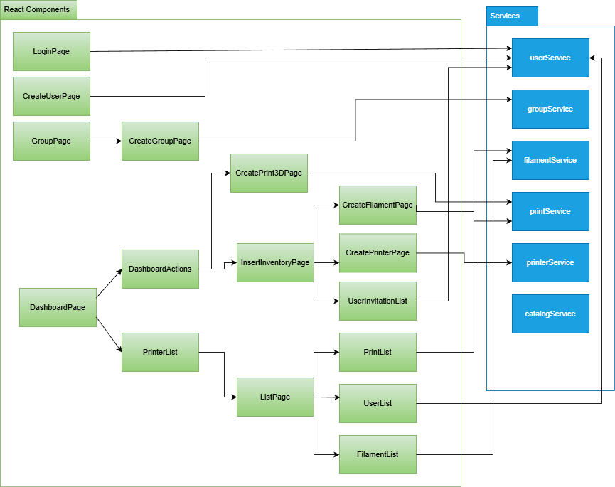

2. **Backend (Server)**
   - Implemented using **ASP.NET Core 8.0** (C#).
   - Provides a **REST API** that handles CRUD operations between the frontend and the database.
   - Organized in a layered architecture:
     - **Controllers**: Handle HTTP requests and route them to the business layer.
     - **Business Logic Layer (BLL)**: Encapsulates the core application logic and validation,transforming objects received from the frontend (matching client-side structure) into objects used by the Data Access Layer for database operations.
     - **Data Access Layer (DAL)**: Interacts with the database through **ADO.NET** and stored procedures.

**Server Architecture**

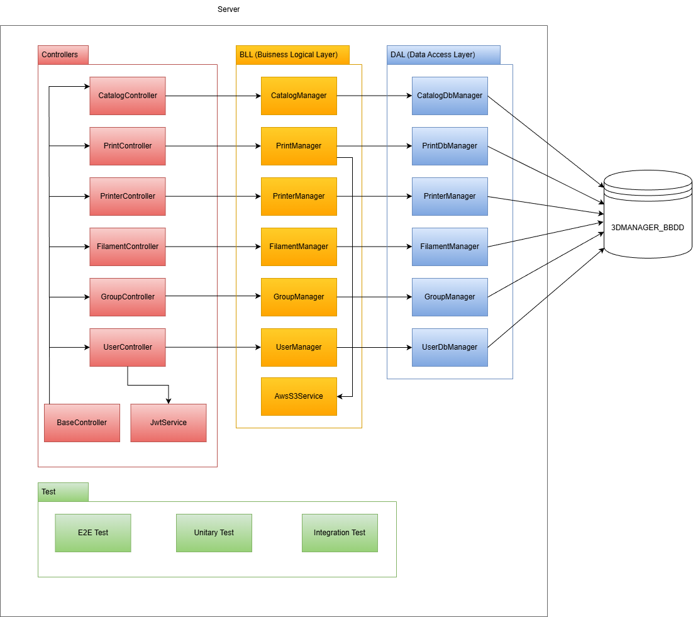

3. **Database**
   - Managed with **MySQL**, running locally during development.
   - Accessed through a **connection string** defined in the backend configuration.
   - Communication occurs via SQL commands and stored procedures executed from the DAL.
   
**Domain Model**
The domain model represents the persistent entities of the application, their main attributes, and the relationships between them. This diagram provides a clear view of how data is structured within the system.
The illustration shown corresponds to the EER diagram used during the database design phase.

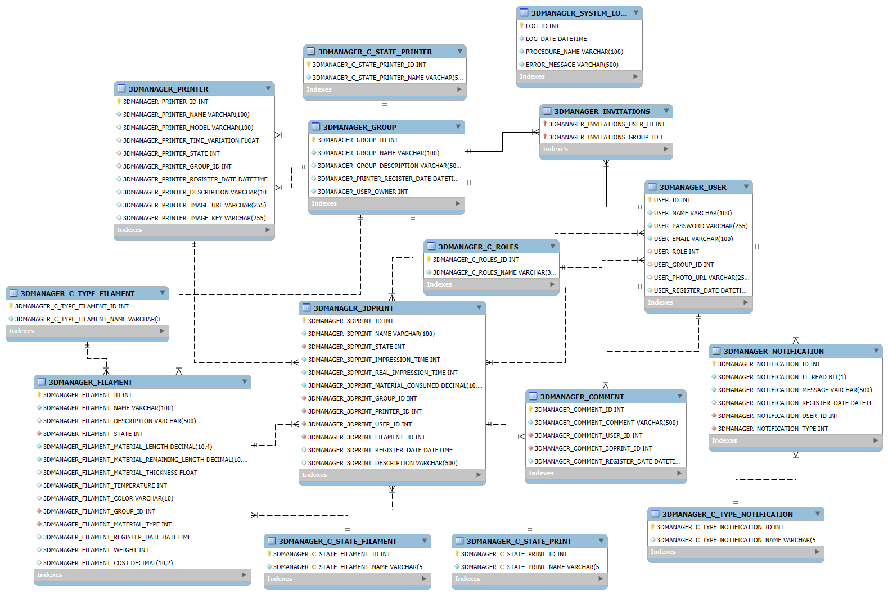


### Communication and Protocols

All communication between the client and the server occurs via **HTTP/HTTPS** using **JSON** as the message format.

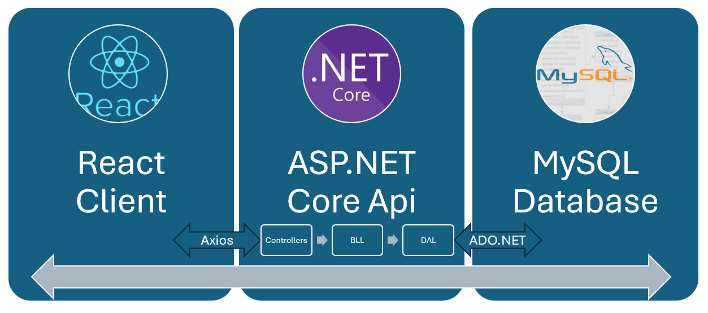

- Frontend <-> Backend: HTTPS requests made with **Axios**.
- Backend <-> Database: ADO.NET connections executing SQL and stored procedures.
- Planned deployment environment: **Microsoft Azure**, where each service can be hosted as a managed resource (App Service, Azure SQL, or container-based deployment).

### REST API Definition
- The API specification is automatically generated at runtime using **Swashbuckle.AspNetCore**.
- The OpenAPI document (`swagger.json`) is exported from the application build.
- This approach allows API documentation to be browsed directly in GitHub Pages or the repository :

>Current swagger version : https://codeurjc-students.github.io/2025-3DManager/swagger.html  

### API Initialization and inyection dependencies

The server initialization is handled through the Program.cs file, which centralizes service registration, dependency injection, and middleware configuration using the native ASP.NET Core dependency injection container. During startup, the application loads its configuration from base appsettings.json files, environment-specific configuration files, and environment variables, allowing the server behavior to adapt seamlessly across development, CI, and production environments. User secrets are also supported to securely manage sensitive credentials in local setups.

All application components are registered with explicit lifetimes (Scoped or Singleton), clearly separating business logic (BLL), data access (DAL), and external services. This includes domain managers, database managers, JWT services, and integrations such as Amazon S3 for file storage. This design promotes modularity, testability, and easy replacement of implementations depending on the execution context.

Authentication is implemented using JWT (JSON Web Tokens), with issuer, audience, lifetime, and signing key validation configured through middleware. Additionally, Swagger is enabled in development environments to provide interactive API documentation and facilitate endpoint inspection and authentication testing during development. The licenses like the automapper uses load in this file too.

Finally, a dedicated CI environment configuration ensures that the database seeding process runs automatically when the application starts in CI. This guarantees that the API is always launched with a known and consistent initial state, enabling fully autonomous and reproducible end-to-end test execution without external dependencies or manual intervention.


## Quality Assurance

This section describes the quality control mechanisms implemented throughout the development process, including automated testing, static analysis tools, and software metrics.

### Automated Testing
- **Test Types**
  - Automated tests have been implemented for both the client (frontend) and server (backend) parts of the application. The testing strategy follows an incremental approach, ensuring continuous validation of functionality at different layers.

- **Frontend**:
  - Unit Tests: Focused on individual React components and utility functions.
  - Integration Tests: Validate the interaction between components and API calls.
  - End-to-End (E2E) Tests: Simulate user interactions across the entire application to ensure overall behavior consistency.

- **Backend**:
  - Unit Tests: Verify the correctness of the business logic (BLL) and data access layer (DAL) independently.
  - Integration Tests: Validate the proper functioning of controllers, database connections (MySQL), and services.
  - System/E2E Tests: Currently verify that data is correctly rendered across components, simulating parts of user flows, but do not yet cover full user interactions.

### Test Execution and CI Integration

Two Continuous Integration (CI) workflows are configured in GitHub Actions:

- **Basic CI**:
  - Triggered on every push from feature branch.
  - Builds the project and executes unit tests for both frontend and backend.

- **Full CI**:
  - Triggered on pull requests or merges into develop and main.
  - Builds all components, executes unit + integration + system/E2E tests.
    
### Static Code Analysis
- **Tools Used**
  - Frontend: ESLint with React and TypeScript plugins (@eslint/js, typescript-eslint, eslint-plugin-react-hooks) ensures code quality, detects unused variables, and enforces consistent coding standards.
  - Backend: SonarQube integrated with **Visual Studio** via the **SonarLint extension**.  This provides live code analysis within the IDE, highlighting code smells, potential bugs, and maintainability issues. 


## Development Process

The development process of the project follows an iterative and incremental model inspired by the Agile methodology.
It adopts selected practices from Kanban, focusing on continuous improvement, frequent delivery, and control task management through an organization board.

### Task Management

- **Project management** is based on GitHub Issues and GitHub Projects, using a Kanban-style visual board to organize and prioritize tasks.
  - GitHub Issues are used to record and describe development tasks, and improvements.
  - Labels ( bug, current phase) help categorize and track progress.

- GitHub Projects provides a Kanban board with columns such as:
 - No status
 - ToDo
 - In Progress
 - Done

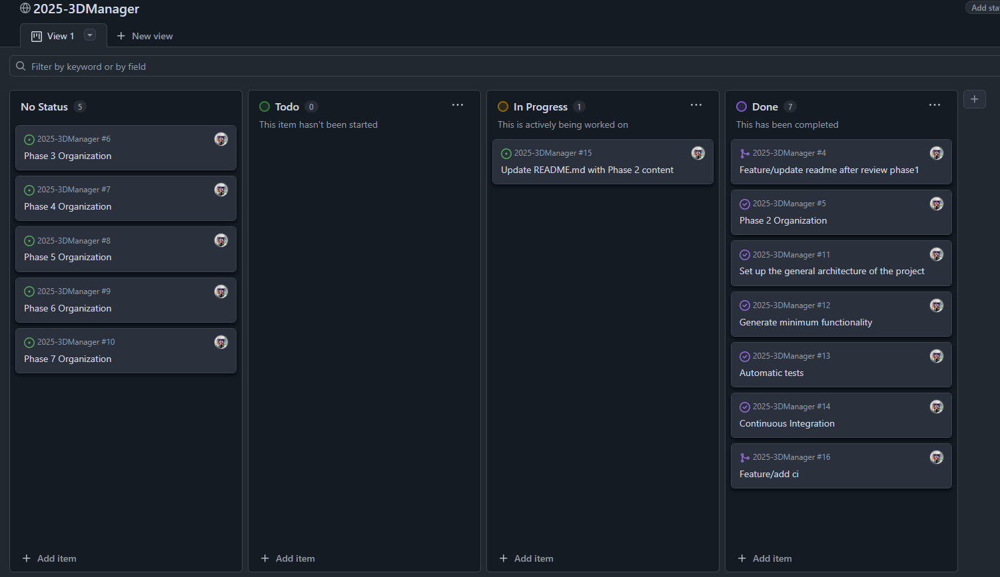

This setup allows for a clear visual representation of the project’s status and facilitates iterative planning and progress tracking.

### Git Version Control

Version control is managed using Git with GitHub as the remote repository.
A branch-based workflow is adopted to ensure safe integration and controlled deployment.

**Branching Strategy**

The project follows the **GitFlow model**, which defines two permanent branches and several auxiliary ones:

- **main** : Contains production-ready code corresponding to stable releases.  
- **develop** : Serves as the integration branch for features that have been completed and tested.  

**Supporting Branches:**
- **feature/** : Used for developing new functionalities or enhancements. These branches are created from `develop` and merged back once completed and reviewed.  
- **release/** : Created from `develop` to prepare and stabilize a version before merging it into `main`.  
- **hotfix/** : Used for urgent fixes directly on `main`. Once fixed, changes are merged into both `main` and `develop` to keep consistency.  

This workflow differs from the simpler **GitHub Flow** which merges features directly into `main` by introducing a clear separation between development, release preparation, and production code. This structure provides better control for testing, integration, and versioning, which fits the project’s incremental and iterative approach.

During development, each new feature or bug fix is implemented in its own branch. Once finished, it is merged into `develop` through a Pull Request after code review and successful CI execution. Branches are deleted after merging to keep the repository clean and organized.


**Git Metrics**
|Metric |	Description |Phase|
|-------|-------------|-----|
|Commits|	Approximately 12 commits across all branches.| Phase 2 |
|Commits|	Approximately 120-125 commits across all branches.| Phase 3 |
|Branches|	Around 4 active branches during development.| Phase 2 |
|Branches|	Around 14 branches created during development.| Phase 3 |
|Pull Requests|	Around 1 pull request .| Phase 2 |
|Pull Requests|	Around 14 pull request .| Phase 3 |
|Contributors|	1 developer and 1 Supervisor .| Phase 2 and 3 |

Phase 2 metrics:
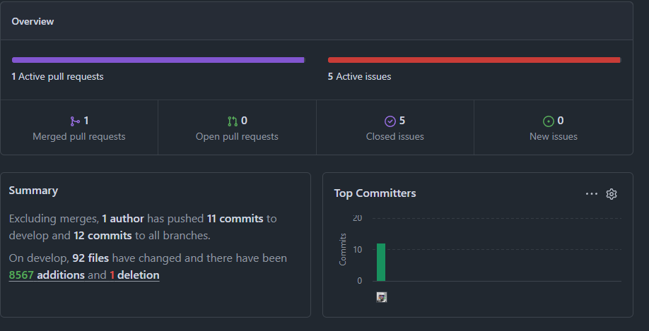

Phase 3 metrics (Last month of the phase) 
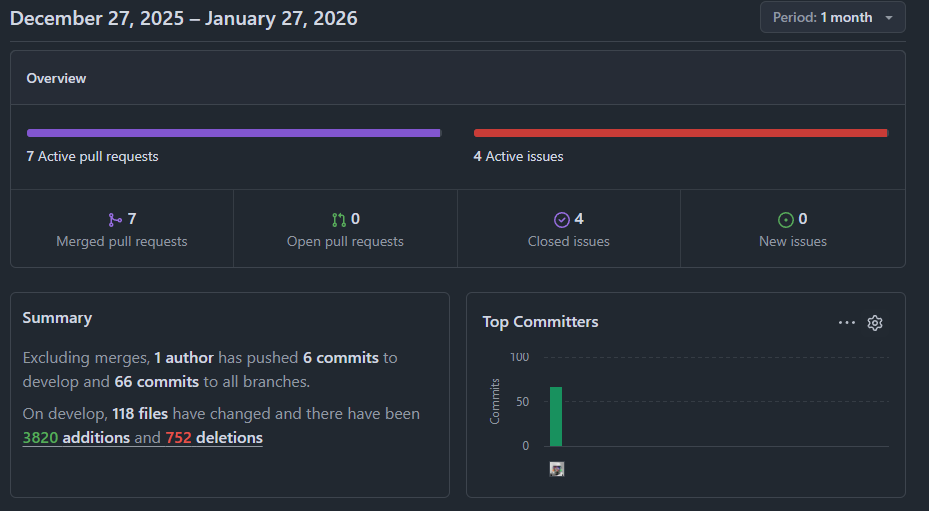

### Continuous Integration (CI)

Automated Continuous Integration is implemented through GitHub Actions, ensuring that each code change is verified before being merged.

**CI Workflows**

- Basic CI
  -  The automated workflows are designed to run on every commit pushed to the remote repository. The basic workflow is divided into two main jobs:
  - Both jobs are executed independently, ensuring that changes in either the frontend or backend are validated automatically on each commit. This structure keeps the repository in a consistent and test-verified state at all times.
    


  - Frontend Job:
    - Builds the client application.
    - Runs unit tests for the frontend.
      
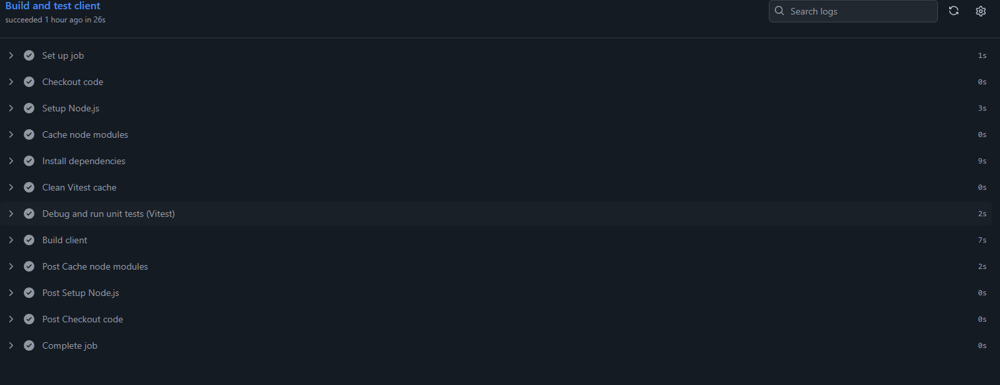

  - Backend Job
    - Builds the server application.
    - Executes unit tests for the backend
      
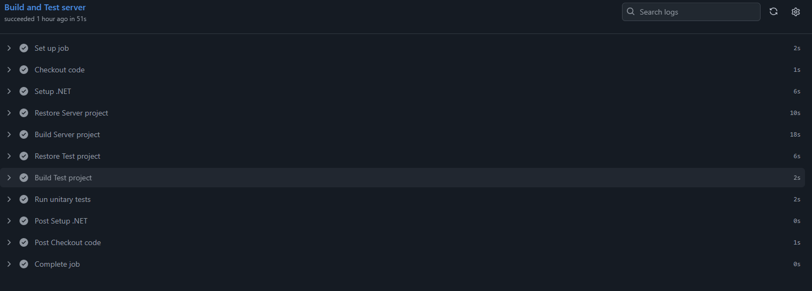

- Full CI
  - A full workflow is triggered for every pull request targeting develop or main. Its goal is to ensure that all changes are fully validated before being merged into critical branches.
    
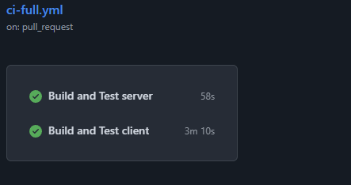

  - Frontend Job:
    - Builds the client application.
    - Runs unit tests .
    - Executes integration tests .
    - Runs E2E tests
      
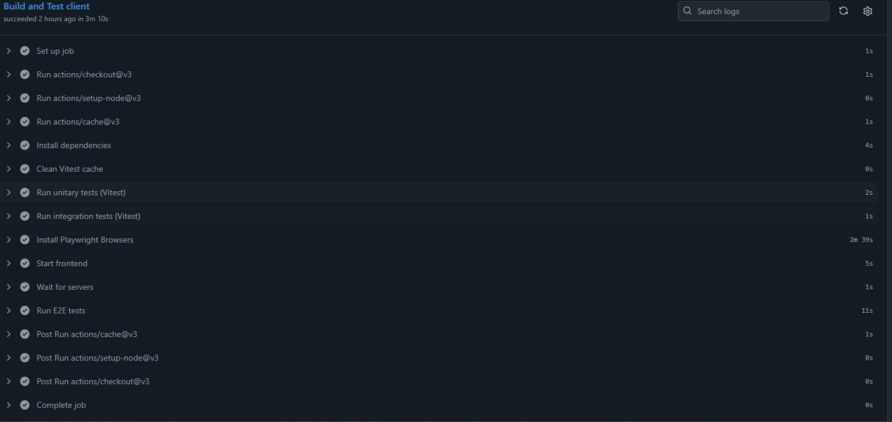

  - Backend Job
    - Builds the server application.
    - Executes unit, integration and e2e test, covering controllers business logic, and data access layers.
      
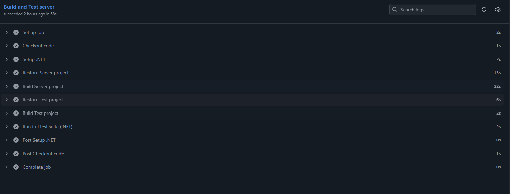 


## Code Execution and editing

This section describes how to run, edit, and test the application starting from the project’s source code.

### Repository Setup

The project repository is publicly hosted under the URJC (Universidad Rey Juan Carlos) student projects organization

### Database Setup

- The application uses a MySQL database running locally during development.
- The database can be started using a local MySQL service (MySQL Workbench)

### Database Initialization

- The repository includes a SQL schema defining the main tables and entities with initial columns.
- Additionally, a stored procedure is provided for retrieving printer names from the system.
- The connection is configured in the backend via the connection string inside the application settings file (appsettings.json).
- **For security**, the connection string is stored in user secrets rather than in plain text, preventing sensitive data from being exposed in the repository.
  
> In future versions, the database may be migrated to a cloud environment.

### Application Execution

- Run Entire Solution via Visual Studio. The simplest way to execute both the backend and frontend together is through Visual Studio:
  - Open the solution file (.sln) in Visual Studio.
  - Select the project configuration (Debug/Release).
  - Press F5 or click Run to start both services.
  - The backend will automatically launch the Swagger UI to test API endpoints.

### Generate OpenAPI file (swagger.json)

- Downloads the OpenAPI document directly from the running API and saves it into the SwaggerDoc folder.
   ```Invoke-WebRequest -Uri "https://localhost:7284/swagger/v1/swagger.json" -OutFile .\SwaggerDoc\openapi.json```

- Generate HTML documentation with Redocly
   ```npx @redocly/cli build-docs SwaggerDoc/openapi.json --output SwaggerDoc/swagger.html```


### Test Execution

**Backend Tests**

- Backend automated tests are executed using Visual Studio’s Test Explorer, which provides an integrated interface for discovering, running, and debugging all test cases.
- To enable Visual Studio test execution, the project uses the xUnit test Nuget package *xunit.runner.visualstudio*

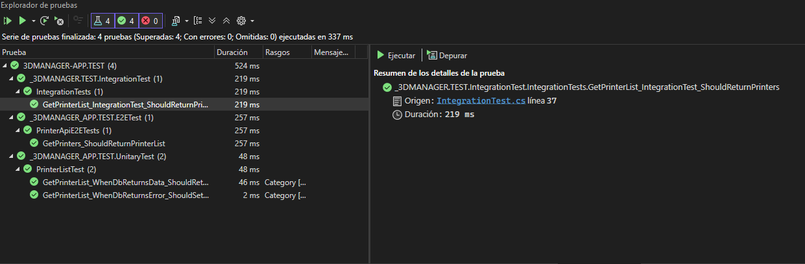 

Another picture of tests explorer in version 0.1.0 

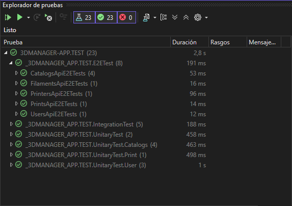 

- To execute de test in backend using the standard .NET CLI command:
    -`dotnet test` 

    -However, due to the project structure, this command must be executed inside the test subproject directory (for example, 3DMANAGER-APP.Server.Tests) to ensure that the correct test assemblies are discovered and executed.
    If the command is run from the root directory of the server project, it is necessary to specify the relative path to the test project file.

**Frontend Tests**

Frontend tests can be executed either:

- On terminal commands:
- Through an interactive UI mode (for both unit tests and E2E tests)

To execute the test on both forms, you can use the following script writed on the package.json:

  - "test": "vitest",
  - "test:ui": "vitest --ui", 
  - "test:e2e": "playwright test",
  - "test:e2e:ui": "playwright test --ui"
    
On the terminal these commnads are used like : 
  - `npm run test` : runs unit tests in the console
  - `npm run test:ui` : opens a graphical UI to run and debug tests
    
  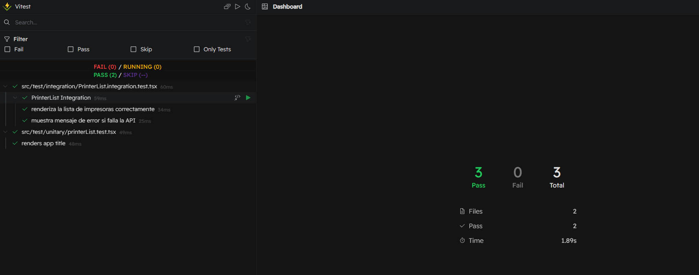

  A picture on 0.1.0 version:

  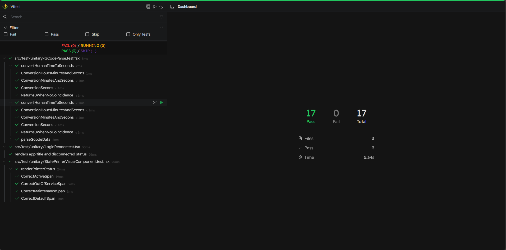

  - `npm run test:e2e` : runs Playwright E2E tests in console mode
  - `npm run test:e2e:ui` : opens the Playwright test runner interface, showing browser execution visually

  

  A picture on 0.1.0 version:

    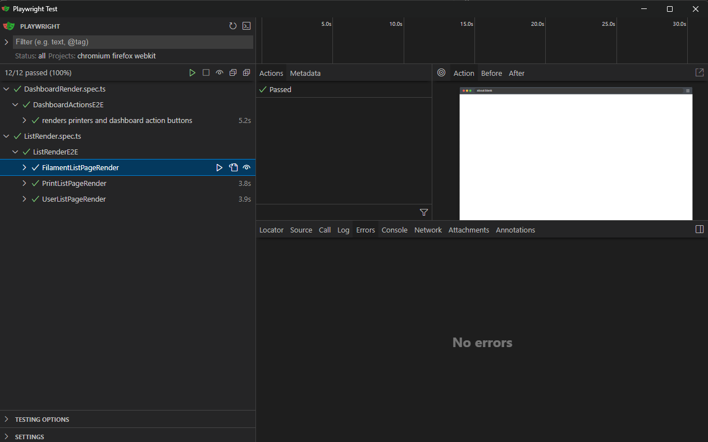

#### Test Architecture

A fully isolated and self-contained testing architecture was designed for end-to-end testing. A dedicated support project was created to handle database initialization for tests, including schema creation, table definitions, stored procedures, and controlled data seeding. This process is strictly limited to the CI/Test database through explicit safety checks, preventing accidental execution in non-test environments.

The testing setup relies on asynchronous fixtures and a custom WebApplicationFactory to automatically prepare the environment before test execution. These fixtures initialize the database, bootstrap the API with test-specific configuration, and provide an authenticated HTTP client shared across tests. This approach ensures that E2E tests are independent from external data or previous state, delivering reproducible and reliable results both locally and in CI pipelines.

**Fixtures**
Fixtures are used to manage shared setup and teardown logic across tests. In this project, asynchronous fixtures are responsible for initializing and cleaning up the test database, as well as creating authenticated HTTP clients. They run automatically before and after the test suite (or test collection), ensuring a consistent and isolated environment while reducing duplication and improving test stability.

---

### Deployment

**Docker Image Generation**
The Docker image for the application is produced through a unified build process that packages both the backend (ASP.NET Core 8) and the frontend into a single container. During the build stage, the server is compiled and published using the .NET SDK, while the client is built with its corresponding tooling. 

In local for test the correct build, the Docker image is generated through a standardized build process that must be executed from the folder containing both the docker-compose.yml and the .env file, ensuring that all environment variables are correctly injected during the build.

- In local to test the image is created , it used: ```docker compose build --no-cache```
- Once built, the application can be started with : ```docker compose up -d```
- Is stopped or fully removed (including volumes) with: ```docker compose down -v```

**Packaging and Distribution**
The application is packaged into a single Docker image that includes both the client and the server.
Deployment is coordinated using Docker Compose, which simplifies local execution and service orchestration.
The application artifact is published on DockerHub, from where Docker automatically pulls the image when running the provided docker-compose.yml.

[Link to DockerHub](https://hub.docker.com/r/ivicenter2018/3dmanager-app/tags)

Download artifact ```oras pull docker.io/ivicenter2018/3dmanager-app:0.1```

### Release Creation

#### Docker
For production releases, automated GitHub workflows were created to handle the entire pipeline. These workflows are triggered by specific events—such as pushing a tagged commit or merging into the release branch—and are responsible for building the Docker image, running static analysis, packaging the final artifact, and publishing the image to DockerHub. This ensures that every release is reproducible, versioned, and deployed consistently across environments.

#### Branches managment

Since the project follows the **GitFlow branching model**, releases will be generated using a dedicated `release/*` branch derived from `develop`. This approach allows for stable and controlled version management. The planned workflow is as follows:

1. **Branch Creation**  
   When the `develop` branch reaches a stable point and includes all features planned for the next version, a new `release` branch will be created from it.  
   This branch will serve as an isolated environment to prepare the new version of the application without interrupting ongoing feature development.

2. **Stabilization Phase**    
   Continuous Integration (CI) pipelines will automatically build the project and execute all tests (unit, integration, and end-to-end) to ensure that the release remains stable before deployment.

3. **Release Finalization**  
   Once the release has been tested and validated, it will be merged into both the `main` and `develop` branches.  
   - The merge into `main` marks the official release and will be tagged with a version number (for example, `v0.1.0`).  
   - The merge back into `develop` ensures that if there are any fixes or updates made during the release process remain consistent with ongoing development.

4. **Deployment and Packaging**  
   After finalization, a Docker image of the application will be generated and prepared for deployment to **Azure App Service** or **Azure Container Apps**.  
   In future iterations, this process will be automated through **GitHub Actions** workflows that handle version tagging, image building, and deployment.
   > This step is planned but not implemented until phase 5

