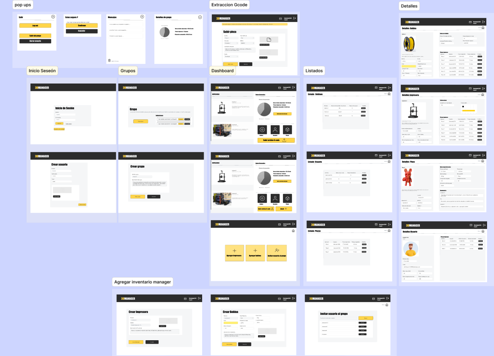
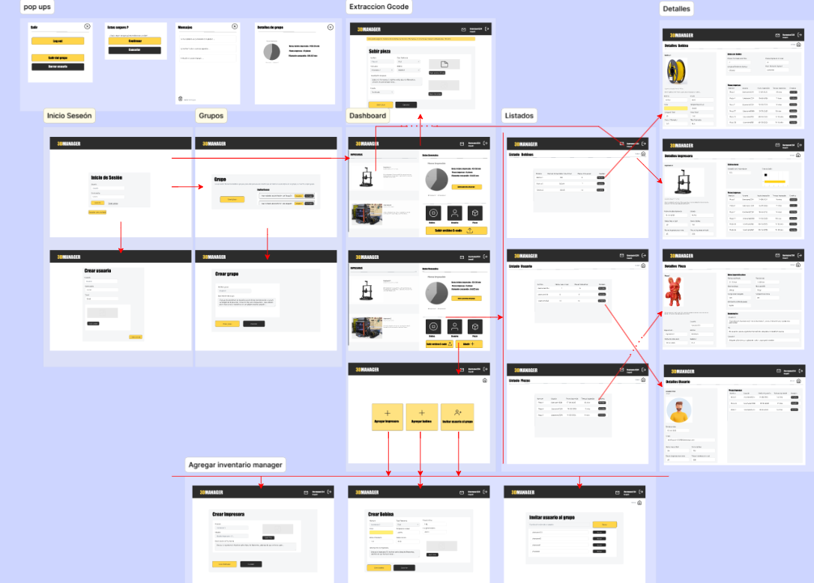
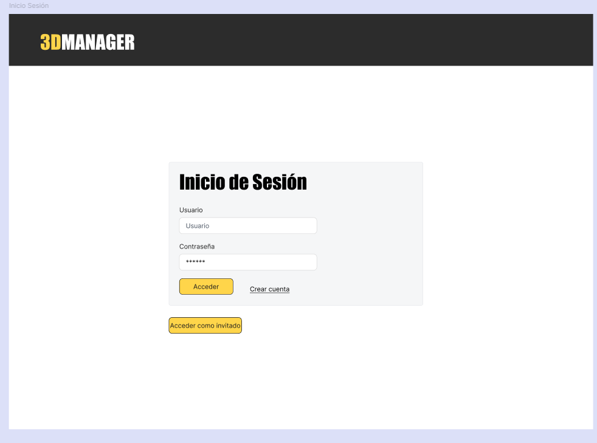
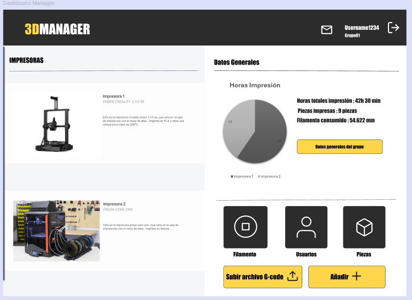
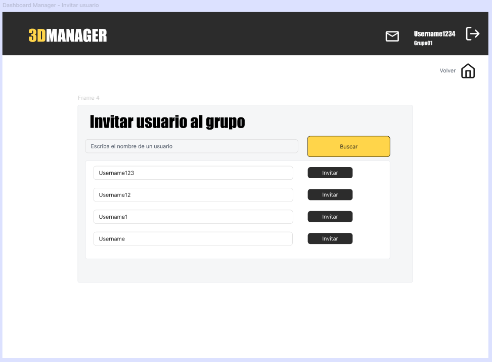

# 2025-3DManager
## Author and Supervisor

**Author:** Ismael Vicente Rodriguez  

**Email:** [i.vicenter.2018@alumnos.urjc.es](mailto:i.vicenter.2018@alumnos.urjc.es)

**Supervisor:** Michel Maes Bermejo  

**Email:** [michel.maes@urjc.es](mailto:michel.maes@urjc.es)

## Introduction

This web application is being developed as part of my final degree project for the Double Degree in Computer Engineering and Computer Science Engineering.

The developed web application aims to provide a comprehensive management platform for 3D printers and the materials used in the printing process.
Within this platform, users will share a common workspace as part of a group, where they can upload 3dPrints, comment on other members’ projects, and actively collaborate.
In addition, the system will deliver detailed insights on material usage and estimated printing times, ensuring efficient inventory tracking and production management within the group.
Ultimately, the goal is to centralize collaboration, monitoring, and optimization of 3D printing processes in a single, unified solution.

A common use case is the application for managing the resources of a 3D printing shop. In this scenario, a group is created to centralize the administration of the shop’s resources and maintain accurate inventory control. This includes monitoring printer usage time, tracking filament and material consumption, as well as recording 3dPrints and the resources utilized, whether in terms of time or supplies.

> At this stage, only the functional and technical objectives of the application have been defined. The development process has not yet started.

## Progress
**Current Phase** : 1
### Grant Diagram

## Methodology
The project is developed in phases, structured as follows:

| Phase | Description | StartDate | EndDate | Deadline |
|-------|-------------|-----------|---------|----------|
| Phase 1 | Definition of functionalities and screens |September 01 |September 14 | September 15 |
| Phase 2 | Repository, testing, and CI | | | October 15 |
| Phase 3 | Version 0.1 - Basic functionality and Docker | | | December 15 |
| Phase 4 | Version 0.2 - Intermediate functionality | | | March 1 |
| Phase 5 | Version 1.0 - Advanced functionality | | | April 15 |
| Phase 6 | Report | | | May 15 |
| Phase 7 | Defense | | | June 15 |

### Phase Details

- **Phase 1 - Definition of functionalities and screens:** In this phase, the web functionalities and interaction design (screens, transitions, etc.) will be defined. Functionality will be differentiated according to user roles (guest, registered user, and administrator).
  
- **Phase 2 - Repository, testing, and CI:** The Git repository, client and server projects will be created, and minimal functionality to connect client, server, and database will be implemented. Minimal automated tests will be set up, and the CI system configured.

- **Phase 3 - Basic functionality and Docker:** Functionality will be extended to the basic features (with corresponding automated tests) and the application will be packaged in Docker. Continuous delivery will be added. Version 0.1 of the application will be released.

- **Phase 4 - Intermediate functionality:** Functionality will be extended to the intermediate features (with corresponding automated tests) and version 0.2 will be released. The application will also be deployed in this phase.

- **Phase 5 - Advanced functionality:** The application will be finalized and version 1.0 released.

- **Phase 6 - Report:** The first draft of the final report will be prepared.

- **Phase 7 - Defense:** The final project defense will take place.

## Objectives
### Functional Objectives
- Create users and allow registration with different roles and permissions.
- Implement CRUD operations for the entities: printers, filaments, 3dPrints, and users.
- Visualize data extracted from 3D printing G-code files to provide technical insights into the printing process.
- Send notification emails to users, including alerts about comments on 3dPrints or depleted filaments.
- Estimate printing times based on the history of 3dPrints and printers.
- Display user notes for printed 3dPrints.
- Develop a comprehensive system that enables the management and control of 3D printing processes.

### Technical Objectives: Architecture and Project Technologies

#### 1. General Structure
- **Architecture:** Monolithic with REST API implemented in ASP.NET Core (.NET 8), with logical layer separation
- **Frontend:** Single Page Application (SPA) implemented in React, communicating with the backend via HTTP calls to the REST API.  
- **Database:** MySQL, using stored procedures for all SQL logic.

#### 2. Detailed Technologies
| Layer / Component | Technology / Tool | Notes |
|------------------|-----------------|-------|
| Backend (REST API) | ASP.NET Core Web API (.NET 8) | Controllers, BLL, and DAL(ADO.NET + stored procedures) organized in layers with clear separation of responsibilities |
| Frontend (SPA) | React | Communicates with backend via fetch or Axios, interactive and dynamic UI design |
| Database | MySQL | Stored procedures, initialization scripts, and sample data |
| Automated Testing | XUnit (backend), Selenium (UI) | Validation of main functionalities and API endpoints |
| API Documentation | Swagger/Postman | Interactive documentation with Swagger, Postman collection for interactive and exportable testing.|
| CI/CD | GitHub Actions | Build, test, and automatic deployment pipeline to Azure |
| Deployment | Azure App Service / Docker Container | Deploy backend and frontend, scalable and ready for load testing |
| Repository | GitHub |Version control |

#### 3. Data Flow
1. The user interacts with the React frontend.  
2. React makes HTTPS calls to the ASP.NET Core backend.  
3. The API calls the BLL to process business logic.  
4. The BLL calls the DAL, which executes stored procedures in MySQL via ADO.NET.  
5. Results are returned to the BLL, then to the API, and finally to the frontend to display data or reports.
   
## Functionalities 

### User
#### Create user
A user is able to register in the application and create an account. 
- Scope: Basic  
- Users: All  

#### Log in as user
A user is able to access the application with credentials, enabling access to group resources. 
- Scope: Basic  
- Users: Base user, Manager  

#### Log in as guest
A guest user is able to access the application in demo mode with mock data, allowing basic navigation to test the application.  
- Scope: Basic  
- Users: Guest  

---

### Group

#### Create group
A user is able to create a new group that includes users, printers, filaments, and 3D prints.
- Scope: Basic  
- Users: Base user  

#### Edit a group
A user is able to edit the details of an existing group.
- Scope: Basic
- Users: Manager

#### Delete a group
A user is able to delete an existing group.
- Scope: Basic
- Users: Manager

#### Join a group
A user is able to join an existing group.
- Scope: Basic  
- Users: Base user  

#### Leave a group
A user is able to leave a group. Their resources are no longer shown in listings but remain available in history and estimations.  
- Scope: Intermediate  
- Users: Base user  

#### Transfer management
A user is able to transfer their manager role to another user in the group.
- Scope: Intermediate  
- Users: Manager  

---

### Dashboard

#### Retrieve general data
A user is able to view a summary with aggregated printing metrics, including hours, 3DPrints, and material.
- Scope: Basic  
- Users: All  

#### Retrieve group data for pop-up
A user is able to quickly view group statistics in pop-up windows. 
- Scope: Intermediate  
- Users: All  

#### Upload 3dPrint
A user is able to upload a GCODE file and generate a new 3D print in the system with its metrics.  
- Scope: Basic  
- Users: Base user, Manager  

#### Create printer
A manager user is able to register a new printer in the group inventory. 
- Scope: Basic  
- Users: Manager  

#### Create Filament
A manager user is able to register a new filament along with its technical data. 
- Scope: Basic  
- Users: Manager  

#### Invite user to group
A manager user is able to send an invitation to another user to join the group.
- Scope: Basic–Intermediate  
- Users: Manager  

---

### Listings

#### User list
A user is able to view the users of the group. 
- Scope: Basic  
- Users: All  

#### Filaments list
A user is able to view the active filaments in the group. 
- Scope: Basic  
- Users: All  

#### 3dPrints list
A user is able to view the 3D prints associated with the group.  
- Scope: Basic  
- Users: All  

#### Notifications list (app)
A user is able to view app notifications.  
- Scope: Intermediate  
- Users: All  

#### Printer list
A user is able to view the printers associated with the group.  
- Scope: Basic  
- Users: All  

---

### Details

#### Filament details
A user is able to view complete information about a filament, including its consumption and associated 3D prints. 
- Scope: Intermediate  
- Users: All  

#### User details
A user is able to view activity metrics of a user within the group.
- Scope: Intermediate  
- Users: All  

#### Printer details
A user is able to view detailed information about a printer, including hours, 3D prints, and success rate.
- Scope: Intermediate  
- Users: All  

#### 3dPrint details
A user is able to view printing metrics, including estimated vs. actual time, material used, and printer. 
- Scope: Intermediate  
- Users: All  

#### 3D Print files
A user is able to view and download files related to a 3D print.
- Scope: Advanced
- Users: Base user, Manager

#### 3dPrint comments
A user is able to write and view comments about a 3D print in the interaction section. 
- Scope: Intermediate  
- Users: Base user, Manager  

---

### Estimations and calculations

#### Estimated real printing time based on history
A user is able to adjust predictions by comparing them with previously printed 3D prints. 
- Scope: Intermediate  
- Users: Base user, Manager  

#### Estimated time variation per printer
A user is able to adjust printing times for each printer based on its historical data. 
- Scope: Intermediate  
- Users: Base user, Manager  

#### Dashboard charts
A user is able to view visual representations of monthly usage, material consumption, and 3D prints. 
- Scope: Intermediate  
- Users: All  

#### Printer detail chart – success rate
A user is able to view a visual indicator of the percentage of successful prints. 
- Scope: Intermediate  
- Users: All  

#### Image processing
A user is able to associate and view photos of 3D prints to complement the information. 
- Scope: Intermediate  
- Users: Base user, Manager  

---

### Additional information

#### Email notification when filament is running low
A manager user is able to receive automatic notifications when a filament is nearly depleted.  
- Scope: Advanced  
- Users: Manager  

#### Email notification when receiving a comment on a 3dPrint
A user is able to receive automatic notifications when a 3D print receives a comment.  
- Scope: Advanced  
- Users: Base user, Manager  

#### Generate PDF when decommissioning a printer or filament
A user is able to view a document containing the historical data of a decommissioned resource. 
- Scope: Advanced  
- Users: Manager  

#### Generate 3D Model of a 3dPrint
A user is able to view a 3D printed model of a 3dPrint uploaded in the group. 
- Scope: Advanced  
- Users: ALL

> **Note:** It will be developed according to the workload of the corresponding phase.

## Analysis

### Screens and Navegation
An initial prototype of the application screens has been created using **Figma**.  
The prototype provides a visual overview of the different sections of the application and their interactions. **Its not the final version**

---

This diagram shows the flow between screens, illustrating how users navigate through the application.

#### Interface Summary
- **Login:** Once the user logs in:  
  - If the user belongs to a group, they are directed to the group **dashboard**.  
  - If not, they are taken to screens to **create or join a group**.  

- **Dashboard:**  
  - Displays a list of printers and access to the rest of the inventory (Filaments, 3dPrints, users).  
  - Provides general visualization of key data and metrics.  
  - For **Managers**, additional options allow adding new inventory elements or users. Selecting the entity type will navigate to the corresponding creation screen.  
 
- **Lists and Details:**  
  - From the inventory lists, users can access detailed information for each printer, filament, 3dPrint, or user.  
  - Each entity has its own dedicated details screen.  

- **Navigation:**  
  - All screens include a **button that redirects to the dashboard**, ensuring easy access to the main application area at any time.

#### Screens
- **Log In**  
  - This screen represents the entry point for users and provides access to create an account or log in as a guest if they do not have one.  
  - Users with an account are directed to the dashboard, new users or those without a group are taken to the group screens. Guests access the dashboard directly.
    

- **User Create**  
  - This screen is used to create a new user account.  
  - Once the required information is submitted, the user is directed to the group section as a new member.

- **Group**  
  - Allows viewing group invitations.  
  - Provides navigation to create a new group.

- **Create Group**  
  - Allows users to create a group via a form.  
  - Once a group is created, the user is redirected to the dashboard to start managing inventory.

- **Dashboard – Base User**  
  - Displays general data and access to main sections.  
  - Allows access to upload 3dPrints, or view lists of printers, filaments, users, and 3dPrints.

- **Dashboard – Manager**  
  - In addition to the base user functionalities, managers can access screens to **add inventory elements or users**.

- **Upload 3dPrint**  
  - Provides a form to create a new 3dPrints.  
  - From this screen, users can go to the 3dPrints detail page or return to the dashboard if they do not complete the action.

- **Upload inventory**  
  - Provides access to the uploads screens.

- **Upload Printer**  
  - Provides a form to create a new printer.  
  - Users can either return to the dashboard or, after creating a printer, navigate to its detail screen.

- **Upload filaments**  
  - Provides a form to create a new filament.  
  - Users can either return to the dashboard or navigate to the filament’s detail page after creation.

- **Invite Users**  
  - Allows inviting new users to the group.  
  - Users can only return to the dashboard from this screen.

- **Filaments List**  
  - Displays a list of filaments in the group with basic information, inviting users to view filament details.  
  - Users can navigate to the filaments details page or return to the dashboard.
   

- **User List**  
  - Displays a list of users in the group with basic information, inviting users to view user details.  
  - Users can navigate to the user details page or return to the dashboard.

- **3dPrints List**  
  - Displays a list of 3dPrints in the group with basic information, inviting users to view 3dPrint details.  
  - Users can navigate to the 3dPrint details page or return to the dashboard.

- **Filament Details**  
  - Displays details about the filament and its usage in printing.  
  - Managers can change the status (e.g., deactivate) or edit some data.  
  - Users can navigate to the list of 3dPrint printed with this filament or return to the dashboard.

- **Printer Details**  
  - Displays details about the printer and its usage.  
  - Managers can deactivate or edit printer information.  
  - Users can navigate to the list of 3dPrints printed with this printer or return to the dashboard.

- **3dPrint Details**  
  - Displays detailed information about a 3dPrint and its printing process.  
  - Some values (like printing times) can be updated.  
  - Comments on the 3dPrint can also be viewed.  
  - Users can return to the dashboard from this screen.

- **User Details**  
  - Displays detailed information about the user and their printing activity.  
  - Users can view comments related to 3dPrints.  
  - Navigation to 3dPrints printed by the user or back to the dashboard is available.

- **Log Out Pop-ups**  
  - Pop-ups that appear when the user clicks the log out button, including confirmation messages for irreversible actions.

- **Notifications**  
  - Pop-up displaying a list of short notifications that inform the user about relevant events or notifications within the application.

- **Group Details Pop-up**  
  - Provides additional information about the group, complementing the dashboard overview.

---
### Entities
This section introduces an initial diagram designed to visually support the previously described content. Its purpose is to clearly illustrate the relationships between the system’s main entities (users, groups, printers, filaments, 3dPrints, and comments) and to provide a better understanding of the application’s logical architecture.
Below is an initial diagram that complements the content and entity definitions.

#### 1.Users
Types of users:
- **Guest** : Access to the application in demo mode with mocked data. Can navigate but cannot interact with real data.  
- **Base User** : Standard user within a group. Can upload 3dPrints (GCODE & STL), check printer and filaments data, and comment on 3dPrints.  
- **Manager** : User with management permissions over the group. In addition to Base User actions, can create/remove printers, filaments, and users within the group.  

#### 2.Group
- Main organizational unit.  
- A group contains: users, printers, filaments, and 3dPrints.  
- Enables resource sharing and collaboration.  
- Each group has at least one **Manager** responsible for resource administration.  

#### 3.Printer
- Always associated with a group and linked to the 3dPrints printed on it.  
- Provides key metrics:  
  - Total printing hours.  
  - Printed 3dPrints (overall and per period).  
  - Variation between estimated and actual printing time (adjusted with history).  
- Acts as a central resource connecting production and material consumption.  

#### 4.Filament
- Represents a roll of filament material.  
- **Technical data:** filament type, color, diameter, ideal temperature, initial weight/length.  
- **Dynamic data:** remaining weight/length, printed 3dPrints using this filament, total consumption.  
- Directly linked to the 3dPrints printed with the material.  

#### 5.3dPrint (GCODE Data and STL)
- The actual production unit.  
- Generated from GCODE file analysis + user-provided data.  
- **Main information:**  
  - Estimated printing time (from slicer).  
  - Actual printing time (provided by user).  
  - Material consumption (linked filament).  
  - Printer used.  
  - Printing date.  
- Acts as the central node connecting printers, filaments, and users.  

#### 6.Comment
- Provides the **social/collaborative layer** over printed 3dPrints.  
- Always associated with a 3dPrint.  
- Facilitates feedback, recommendations, and discussions about printing results.
---
### Users 
#### 1.Guest User
- No registration required.  
- Accesses the application in demo mode with mocked (fictitious) data.  
- Can navigate through the main sections (dashboard, printers, filaments, 3dPrints) to get an approximate user experience.  
- Cannot upload GCODE files, save data, or perform actions on real resources.  

#### 2.Base User
- Member of a group (organization).  
- Can navigate through all sections of their group: printers, filaments, 3dPrints, and comments.  
- Upload GCODE files : automatic extraction of printing data.  
- View personal and group metrics (printed hours, material consumption, produced 3dPrints).  
- Check the status of printers and filaments associated with the group.  
- Add comments on already printed 3dPrints.  

Does **not** have management permissions over the inventory or other users.  

#### 3.Manager User
- Administrator of the group. **Is the owner of the group** 
- Has the same permissions as a Base User (upload 3dPrints, check data, comment).  
- Additionally, has resource management functionalities:  
  - Add/remove printers.  
  - Add/remove filaments.  
  - Add/remove users within the group.
---
### Images and graphics
#### Entity Images
Each main entity **filaments, printers, 3dPrints, and users** will be represented by a image or icon.  
These visual representations serve for quick identification between users and they can instantly recognize the type of entity they are interacting with.  

#### Graphs and Charts
Visualizations will play a key role in making the system’s data more understandable and actionable. Initial implementations include:

- **General Dashboard:** A circular (pie) chart will display the total printing hours of each printer in the group. This allows managers and users to quickly assess the workload distribution among printers.  
- **Printer Details:** Each printer will feature a bar chart showing its success rate over time, providing immediate insight into reliability, and potential areas for maintenance or improvement.

---
#### Algorithms
The application will implement several algorithms to provide automatic calculations and estimations for 3D printing processes:

1. **Printer Success Rate**  
   Calculates the success rate of a printer based on the 3dPrints it prints and their status, automatically assessing performance.

2. **Estimated Printing Time**  
   Automatically estimates the actual time required to complete a 3dPrint, based on historical printing data and trends.

3. **Filament Material Estimation**  
   Estimates the remaining material on a filament according to its usage in the application, allowing better inventory management.

4. **3dPrint Cost Estimation**  
   Calculates the estimated cost of a printed 3dPrint based on the material consumed from the filament used.

These algorithms aim to provide **automated insights**, help optimize resource usage, and assist users in planning and managing 3D printing tasks more efficiently.

## Development Guide

### Index

- [Introduction](#introduction-to-development-guide)
- [Technologies](#technologies)
- [Tools](#tools)
- [Architecture](#architecture)
- [Quality Assurance](#quality-assurance)
- [Development Process](#development-process)
- [Code Execution and editing](#code-execution-and-editing)

---

###  Introduction to development guide

The developed application is a monolithic web application with a Single Page Application architecture. In this type of architecture, all user interaction happens within a single HTML page, while interface updates and navigation logic are handled dynamically on the client without reloading the entire page.

In this project:
- The frontend is implemented with React and TypeScript, using Vite as the build tool and development server. 
- The backend is developed in ASP.NET Core (C#), providing a REST API that handles CRUD (Create, Read, Update, Delete) operations. 
- Data persistence is handled with MySQL, currently in a local environment.

The backend follows a layered structure:
- **Controllers:** receive HTTP requests from the client. 
- **Business Logic Layer (BLL):** applies business rules and operations. 
- **Data Access Layer (DAL):** manages interaction with the database.

Deployment is not yet configured but is planned for Microsoft Azure. 

Development follows an iterative and incremental approach, based on agile principles, with continuous integration and automated quality controls.

#### Technical Summary

- **Type:**  
  Web SPA + REST API, monolithic solution with a clear client-server separation.

- **Technologies:**  
  - **Languages:** TypeScript, HTML, CSS, C#, SQL.  
  - **Frontend:** React, React DOM, Axios, Vite, @vitejs/plugin-react  
  - **Backend:** ASP.NET Core, ADO.NET AutoMapper, Newtonsoft.Json, Swashbuckle.AspNetCore (Swagger/OpenAPI), Microsoft.Extensions.Logging.  
  - **Database:** MySQL.  
  - **Testing (Frontend):** Vitest, @vitest/ui, @testing-library/react, @testing-library/jest-dom, @testing-library/user-event, jsdom, @playwright/test.  
  - **Testing (Backend):** xUnit, Moq, Microsoft.AspNetCore.Mvc.Testing, Microsoft.AspNetCore.TestHost, CoverletCollector, Microsoft.NET.Test.Sdk.

- **Tools:**  
  - **IDEs:** Visual Studio (primary), Visual Studio Code (secondary).  
  - **Version control:** Git (GitHub as remote repository).  
  - **Branch management:** SourceTree.  
  - **Database:** MySQL Workbench.  
  - **Auxiliar:** Postman/Swagger (for API testing), ESLint (static code analysis on client).

- **Quality Assurance:**  
  - Unit, integration and E2E tests both on client and server.
  - Code coverage and automatic validation through CI/CD flows (GitHub Actions).  
  - Static analysis and code reviews in pull requests.

- **Deployment:**  
  - Current stage: local execution.
  - Planned deployment: cloud environment **Microsoft Azure**.
  - Future packaging via Docker (containers for frontend, backend and database).

- **Development Process:**  
  - Iterative and incremental approach.  
  - Versioning with Git and repository on GitHub.
  - Task management using GitHub Issues and Projects (Kanban-style boards).
  - **Continuous integration (CI/CD)**:  
    - *Basic pipeline*: run on pushes to feature branches, compiles and runs unit tests.  
    - *Full pipeline*: run on merges to develop or main, includes compilation, unit tests, integration tests and system tests (E2E).

---

### Technologies

This section describes the **technologies used to execute the application**, both on the client and server sides, as well as the database and deployment environment.  

#### Frontend

The client layer is developed as a **Single Page Application (SPA)** using **React** with **TypeScript**, served and bundled with **Vite**.  
These technologies enable a dynamic, modular, and efficient user interface.

- **React**: Main library for building component-based user interfaces.  
  - [https://react.dev/](https://react.dev/)

- **TypeScript**: A typed language of JavaScript that improves maintainability.  
  - [https://www.typescriptlang.org/](https://www.typescriptlang.org/)

- **Vite**: A development server optimized for React projects.  
  - [https://vitejs.dev/](https://vitejs.dev/)

- **Axios**: HTTP client used to handle requests between the frontend and the backend API.  
  - [https://axios-http.com/](https://axios-http.com/)

**Frontend Testing**

The frontend environment includes several testing tools for different levels of automation:

- **Vitest**: Primary testing framework used to execute unit tests in Vite environments.  
  - [https://vitest.dev/](https://vitest.dev/)
  - Also provides a UI for visually exploring and running tests.

- **Testing Library (React)**: The libraries `@testing-library/react`, `@testing-library/jest-dom`, and `@testing-library/user-event` are used to validate UI behavior and component rendering.  
  - [https://testing-library.com/docs/react-testing-library/intro/](https://testing-library.com/docs/react-testing-library/intro/)

- **Playwright**: Framework for **E2E (end-to-end)** testing that automates browsers to validate complete user flows.  
  - [https://playwright.dev/](https://playwright.dev/)
  - Offers a graphical test runner for inspecting and debugging test execution.

#### Backend

The server is developed with **ASP.NET Core 8.0** using **C#**, following a layered architecture (Controller : Business Logic : Data Access) and exposing a **REST API** for communication with the frontend.

- **.NET 8 (ASP.NET Core)** : A cross-platform, high-performance backend framework for web and API development.  
  - [https://dotnet.microsoft.com/](https://dotnet.microsoft.com/)

- **AutoMapper** : Library used to automatically map between class objects, speeding up development by simplifying data transformations between layers within the server.  
  - [https://automapper.org/](https://automapper.org/)

- **Newtonsoft.Json** : Library for advanced JSON serialization and deserialization.  
  - [https://www.newtonsoft.com/json](https://www.newtonsoft.com/json)

- **Swashbuckle.AspNetCore / OpenAPI** : Generates OpenAPI/Swagger documentation for the REST API.  
  - [https://github.com/domaindrivendev/Swashbuckle.AspNetCore](https://github.com/domaindrivendev/Swashbuckle.AspNetCore)

- **Microsoft.Extensions.Configuration / Logging** : Handles configuration management and application logging during runtime.  
  - [https://learn.microsoft.com/en-us/dotnet/core/extensions/configuration](https://learn.microsoft.com/en-us/dotnet/core/extensions/configuration)
    
- **ADO.NET** : .NET framework components for connecting to data sources and executing SQL queries or stored procedures. Normally used for SQL Server connections, but it can also be used with MySQL via the appropriate MySQL connector
  - [https://learn.microsoft.com/en-us/dotnet/framework/data/adonet/](https://learn.microsoft.com/en-us/dotnet/framework/data/adonet/)

**Backend Testing**

The backend includes multiple frameworks and tools for automated unit and integration testing:

- **xUnit** : Unit testing framework for .NET applications.  
  - [https://xunit.net/](https://xunit.net/)

- **Moq** : Library for creating mock objects during testing.  
  - [https://github.com/moq/moq4](https://github.com/moq/moq4)

- **Microsoft.AspNetCore.Mvc.Testing** and **TestHost** : Used to perform integration tests on ASP.NET Core applications.  
  - [https://learn.microsoft.com/en-us/dotnet/api/microsoft.aspnetcore.mvc.testing](https://learn.microsoft.com/en-us/dotnet/api/microsoft.aspnetcore.mvc.testing)

- **CoverletCollector** : Tool used for collecting and reporting code coverage metrics.  
  - [https://github.com/coverlet-coverage/coverlet](https://github.com/coverlet-coverage/coverlet)
  - Note: This tool has not been fully tested due to the initially limited number of tests.
    
#### Database

The project uses a **MySQL** database running locally during development.  
The backend connects via a **connection string** defined in the configuration file, using stored procedures and database access through **ADO.NET**.

- **MySQL** : Open-source relational database management system.  
  - [https://www.mysql.com/](https://www.mysql.com/)

#### Deployment Environment

The application is planned to be deployed to the **Microsoft Azure** cloud environment.  
In future stages, **Docker** containers will be used to encapsulate the frontend, backend, and database services, enabling consistent and portable deployments.

- **Microsoft Azure** : Cloud platform for hosting web applications, databases, and backend services.  
  - [https://azure.microsoft.com/](https://azure.microsoft.com/)

- **Docker** : Containerization platform that packages the application and its dependencies into isolated units for reproducible deployment.  
  - [https://www.docker.com/](https://www.docker.com/)

---

### Tools

This section describes the **development tools and auxiliary software** used during the creation of the application.  
These tools are distinct from the runtime technologies covered in the previous section.

#### Integrated Development Environments (IDEs)

- **Visual Studio** : Main IDE used for developing the backend in ASP.NET Core and C# and the frontend in React with typescript. Provides full debugging, project management, and integration with GitHub. It also allows you to use a template to generate the React + ASP.NET Core project, and simplifies managing NuGet packages to easily add additional functionality.  
  - [https://visualstudio.microsoft.com/](https://visualstudio.microsoft.com/)

- **Visual Studio Code** : Lightweight editor used as a secondary tool to edit singular files or small adjustments.  
  - [https://code.visualstudio.com/](https://code.visualstudio.com/)

#### Version Control & Task Management

- **Git** : Version control system used to track changes in both frontend and backend code.  
  - [https://git-scm.com/](https://git-scm.com/)

- **GitHub** : Remote repository for code storage, collaboration, and CI/CD workflows.  
  - [https://github.com/](https://github.com/)

- **SourceTree** : Git client for managing branches, commits, and visualizing repository history.  
  - [https://www.sourcetreeapp.com/](https://www.sourcetreeapp.com/)

- **GitHub Issues & Projects** : Task tracking and visual board (Kanban) used to manage features, bugs, and development progress.  
  - [https://docs.github.com/en/issues](https://docs.github.com/en/issues)

#### Database Management

- **MySQL Workbench** : Visual database design, query execution, and schema management tool used during development.  
  - [https://www.mysql.com/products/workbench/](https://www.mysql.com/products/workbench/)

#### Code Quality & Static Analysis

> Not fully tested yet

- **ESLint** : Static code analysis tool for JavaScript and TypeScript. Helps enforce coding standards and catch potential errors early.  
  - [https://eslint.org/](https://eslint.org/)

- **TypeScript ESLint** : Integrates TypeScript type checking with ESLint rules.  
  - [https://typescript-eslint.io/](https://typescript-eslint.io/)
    

#### Testing Tools

- **Postman** : Tool for testing and interacting with the backend API. Used to send requests, inspect responses, and maintain a collection of API test examples.  
   - [https://www.postman.com/](https://www.postman.com/)

- **Playwright** : Used for end-to-end testing of the frontend by simulating user interaction in real browsers.  
   - [https://playwright.dev/](https://playwright.dev/)

- **Vitest** and **Testing Library (React)** : Tools for unit and component testing in the frontend.  
   - [https://vitest.dev/](https://vitest.dev/)  
   - [https://testing-library.com/docs/react-testing-library/intro/](https://testing-library.com/docs/react-testing-library/intro/)

- **xUnit, Moq, TestHost**: Tools for unit, integration, and code coverage testing in the backend.  
   - [https://xunit.net/](https://xunit.net/)  
   - [https://github.com/moq/moq4](https://github.com/moq/moq4)  
   - [https://learn.microsoft.com/en-us/dotnet/api/microsoft.aspnetcore.mvc.testing](https://learn.microsoft.com/en-us/dotnet/api/microsoft.aspnetcore.mvc.testing)  

---

### Architecture

This section describes the **deployment architecture** of the project and the **structure of the REST API** exposed by the backend.
#### Deployment Architecture

The system is structured as a **monolithic Single Page Application (SPA)** consisting of three main components:  
the frontend, backend, and database. Each component runs as an independent process and communicates using well-defined protocols.

1. **Frontend (Client)**
   - Developed with **React**, **TypeScript**, and **Vite**.
   - Structured into services (for communicating with the API), models (data structures), and components (rendered UI elements)
   - Runs locally on the Vite development server during development.
   - Deployed as a static web app in production, in the future will be hosted through **Azure App Service**.

2. **Backend (Server)**
   - Implemented using **ASP.NET Core 8.0** (C#).
   - Provides a **REST API** that handles CRUD operations between the frontend and the database.
   - Organized in a layered architecture:
     - **Controllers**: Handle HTTP requests and route them to the business layer.
     - **Business Logic Layer (BLL)**: Encapsulates the core application logic and validation,transforming objects received from the frontend (matching client-side structure) into objects used by the Data Access Layer for database operations.
     - **Data Access Layer (DAL)**: Interacts with the database through **ADO.NET** and stored procedures.

3. **Database**
   - Managed with **MySQL**, running locally during development.
   - Accessed through a **connection string** defined in the backend configuration.
   - Communication occurs via SQL commands and stored procedures executed from the DAL.

#### Communication and Protocols

All communication between the client and the server occurs via **HTTP/HTTPS** using **JSON** as the message format.

- Frontend <-> Backend: HTTPS requests made with **Axios**.
- Backend <-> Database: ADO.NET connections executing SQL and stored procedures.
- Planned deployment environment: **Microsoft Azure**, where each service can be hosted as a managed resource (App Service, Azure SQL, or container-based deployment).

#### REST API Definition
- The API specification is automatically generated at runtime using **Swashbuckle.AspNetCore**.
- The OpenAPI document (`swagger.json`) is exported from the application build.
- This approach allows API documentation to be browsed directly in GitHub Pages or the repository :
  SWAGGER
---

### Quality Assurance

This section describes the quality control mechanisms implemented throughout the development process, including automated testing, static analysis tools, and software metrics.

#### Automated Testing
- **Test Types**
  - Automated tests have been implemented for both the client (frontend) and server (backend) parts of the application. The testing strategy follows an incremental approach, ensuring continuous validation of functionality at different layers.

- **Frontend**:
  - Unit Tests: Focused on individual React components and utility functions.
  - Integration Tests: Validate the interaction between components and API calls.
  - End-to-End (E2E) Tests: Simulate user interactions across the entire application to ensure overall behavior consistency.

- **Backend**:
  - Unit Tests: Verify the correctness of the business logic (BLL) and data access layer (DAL) independently.
  - Integration Tests: Validate the proper functioning of controllers, database connections (MySQL), and services.
  - System/E2E Tests: Currently verify that data is correctly rendered across components, simulating parts of user flows, but do not yet cover full user interactions.

#### Test Execution and CI Integration

Two Continuous Integration (CI) workflows are configured in GitHub Actions:

- **Basic CI**:
  - Triggered on every push from feature branch.
  - Builds the project and executes unit tests for both frontend and backend.

- **Full CI**:
  - Triggered on pull requests or merges into develop and main.
  - Builds all components, executes unit + integration + system/E2E tests.
    
#### Static Code Analysis
- **Tools Used**
  - Frontend: ESLint with React and TypeScript plugins (@eslint/js, typescript-eslint, eslint-plugin-react-hooks) ensures code quality, detects unused variables, and enforces consistent coding standards.
  - Not fully tested in current phase
---

### Development Process

The development process of the project follows an iterative and incremental model inspired by the Agile methodology.
It adopts selected practices from Kanban, focusing on continuous improvement, frequent delivery, and control task management through an organization board.

#### Task Management

- **Project management** is based on GitHub Issues and GitHub Projects, using a Kanban-style visual board to organize and prioritize tasks.
  - GitHub Issues are used to record and describe development tasks, and improvements.
  - Labels ( bug, current phase) help categorize and track progress.

- GitHub Projects provides a Kanban board with columns such as:
 - No status
 - ToDo
 - In Progress
 - Done

This setup allows for a clear visual representation of the project’s status and facilitates iterative planning and progress tracking.

#### Git Version Control

Version control is managed using Git with GitHub as the remote repository.
A branch-based workflow is adopted to ensure safe integration and controlled deployment.

**Branching Strategy**
- main: Stable branch containing production-ready code.
- develop: Integration branch for features that are completed and tested.
- feature/*: Branches for developing new functionalities or improvements.
- hotfix/*: Used for urgent fixes on the main branch.

During development, each feature or bug fix is developed in its own branch and later merged into develop via a pull request after code review and successful CI execution.
Before it is merged, it is deleted to keep the repository clean.

**Git Metrics**
|Metric |	Description |Phase|
|-------|-------------|-----|
|Commits|	Approximately 12 commits across all branches.| Phase 2 |
|Branches|	Around 4 active branches during development.| Phase 2 |
|Contributors|	1 developer and 1 Supervisor .| Phase 2 |
|Pull Requests|	Around 1 pull request .| Phase 2 |

#### Continuous Integration (CI)

Automated Continuous Integration is implemented through GitHub Actions, ensuring that each code change is verified before being merged.

**CI Workflows**

- Basic CI
  -  The automated workflows are designed to run on every commit pushed to the remote repository. The basic workflow is divided into two main jobs:
  - Both jobs are executed independently, ensuring that changes in either the frontend or backend are validated automatically on each commit. This structure keeps the repository in a consistent and test-verified state at all times.
    

  - Frontend Job:
    - Builds the client application.
    - Runs unit tests for the frontend.
      

  - Backend Job
    - Builds the server application.
    - Executes unit tests for the backend
      

- Full CI
  - A full workflow is triggered for every pull request targeting develop or main. Its goal is to ensure that all changes are fully validated before being merged into critical branches.
    

  - Frontend Job:
    - Builds the client application.
    - Runs unit tests .
    - Executes integration tests .
    - Runs E2E tests
      

  - Backend Job
    - Builds the server application.
    - Executes unit, integration and e2e test, covering controllers business logic, and data access layers.
      
 

---

### Code Execution and editing

This section describes how to run, edit, and test the application starting from the project’s source code.

#### Repository Setup

The project repository is publicly hosted under the URJC (Universidad Rey Juan Carlos) student projects organization

#### Database Setup

- The application uses a MySQL database running locally during development.
- The database can be started using a local MySQL service (MySQL Workbench)

#### Database Initialization

- The repository includes a SQL schema defining the main tables and entities with initial columns.
- Additionally, a stored procedure is provided for retrieving printer names from the system.
- The connection is configured in the backend via the connection string inside the application settings file (appsettings.json).
- **For security**, the connection string is stored in user secrets rather than in plain text, preventing sensitive data from being exposed in the repository.
  
> In future versions, the database may be migrated to a cloud environment.

#### Application Execution

- Run Entire Solution via Visual Studio. The simplest way to execute both the backend and frontend together is through Visual Studio:
  - Open the solution file (.sln) in Visual Studio.
  - Select the project configuration (Debug/Release).
  - Press F5 or click Run to start both services.
  - The backend will automatically launch the Swagger UI to test API endpoints.

#### Test Execution

**Backend Tests**

- Backend automated tests are executed using Visual Studio’s Test Explorer, which provides an integrated interface for discovering, running, and debugging all test cases.
- To enable Visual Studio test execution, the project uses the xUnit test Nuget package *xunit.runner.visualstudio*

 

**Frontend Tests**

Frontend tests can be executed either:

- On terminal commands:
- Through an interactive UI mode (for both unit tests and E2E tests)

To execute the test on both forms, you can use teh following script writed on the package.json:

  - "test": "vitest",
  - "test:ui": "vitest --ui", 
  - "test:e2e": "playwright test",
  - "test:e2e:ui": "playwright test --ui"
    
On the terminal these commnads are used like : 
  - `npm run test` : runs unit tests in the console
  - `npm run test:ui` : opens a graphical UI to run and debug tests
    
  

  - `npm run test:e2e` : runs Playwright E2E tests in console mode
  - `npm run test:e2e:ui` : opens the Playwright test runner interface, showing browser execution visually

  

#### Release Creation

>At the current stage of the project, the release creation process is not yet defined.
