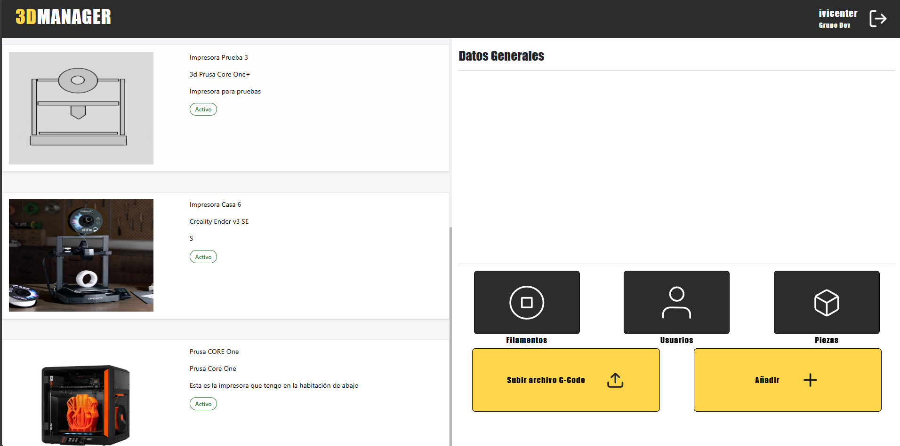
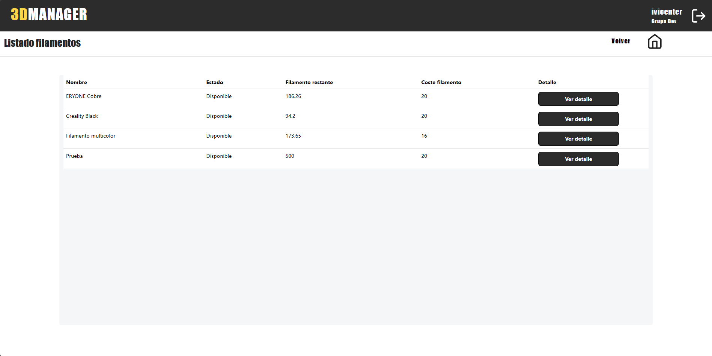
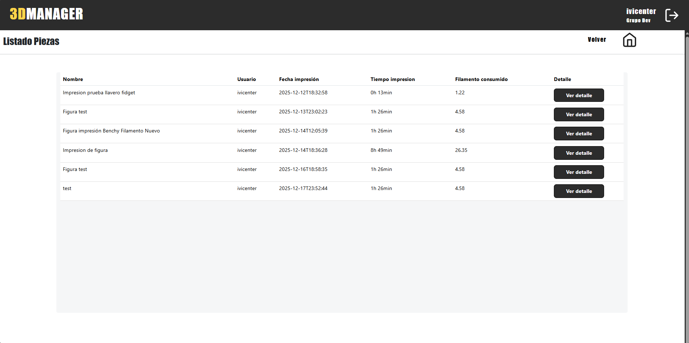
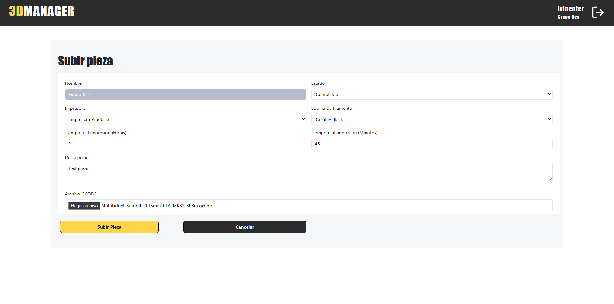

# 2025-3DManager
## Author and Supervisor

**Author:** Ismael Vicente Rodriguez  

**Email:** [i.vicenter.2018@alumnos.urjc.es](mailto:i.vicenter.2018@alumnos.urjc.es)

**Supervisor:** Michel Maes Bermejo  

**Email:** [michel.maes@urjc.es](mailto:michel.maes@urjc.es)

## Introduction

This web application is being developed as part of my final degree project for the Double Degree in Computer Engineering and Computer Science Engineering.

The developed web application aims to provide a comprehensive management platform for 3D printers and the materials used in the printing process.
Within this platform, users will share a common workspace as part of a group, where they can upload 3dPrints, comment on other members’ projects, and actively collaborate.
In addition, the system will deliver detailed insights on material usage and estimated printing times, ensuring efficient inventory tracking and production management within the group.
Ultimately, the goal is to centralize collaboration, monitoring, and optimization of 3D printing processes in a single, unified solution.

A common use case is the application for managing the resources of a 3D printing shop. In this scenario, a group is created to centralize the administration of the shop’s resources and maintain accurate inventory control. This includes monitoring printer usage time, tracking filament and material consumption, as well as recording 3dPrints and the resources utilized, whether in terms of time or supplies.

### Version 0.1

In version 0.1, the application introduces the foundational features for user and group management. After registering, each user can choose to create a new group or join an existing one.
If the user creates a group, they automatically become its owner and gain permissions to manage the group’s inventory, including adding printers, filaments, and inviting new members.

If the user joins an existing group, they will have access to the shared resources and be able to browse the group’s inventory, although they will not be allowed to add new items—except for printed parts, which any group member is permitted to create.

Additionally, this first version includes a guest mode, allowing users to explore the application through a demo environment populated with simulated data. In this mode, users can navigate the interface and view example content, but they cannot modify or add any information.

These are several screenshots of the current version of the application, illustrating the progress made so far and the effort invested in faithfully reproducing the mockups designed during phase 1 of the project. The images showcase the main screens, navigation flow, and core components, demonstrating how the implementation is evolving to match the original design specifications.

#### Dashboard

#### List of filaments and prints

#### Add print form

#### Video Demo v0.1
[Download video](Documentation/Screensv01/3dmanager_V01.mp4)
Description of functionality shown: ## [Funcionalities v.01](Documentation/Readme/FUNCTIONALITIES.md#functionality-v-01)

> [!IMPORTANT]  
> The application is currently under development in phase 4.
> [!NOTE]  
>  For version 0.2, the goal is to deliver a significantly more complete feature set, enabling full editing capabilities across all content managed by the platform. This upcoming release will also introduce intermediate algorithms designed to enhance the information displayed to users, providing a more contextual, dynamic, and insightful experience throughout the application.

## Progress
**Current Phase** : 4
### Grant Diagram

## Methodology
The project is developed in phases, structured as follows:

| Phase | Description | StartDate | EndDate | Deadline |
|-------|-------------|-----------|---------|----------|
| Phase 1 | Definition of functionalities and screens |September 01 |September 14 | September 15 |
| Phase 2 | Repository, testing, and CI |September 16 | October 28 | October 15 |
| Phase 3 | Version 0.1 - Basic functionality and Docker | October 29| | December 15 |
| Phase 4 | Version 0.2 - Intermediate functionality | | | March 1 |
| Phase 5 | Version 1.0 - Advanced functionality | | | April 15 |
| Phase 6 | Report | | | May 15 |
| Phase 7 | Defense | | | June 15 |

### Phase Details

- **Phase 1 - Definition of functionalities and screens:** In this phase, the web functionalities and interaction design (screens, transitions, etc.) will be defined. Functionality will be differentiated according to user roles (guest, registered user, and administrator).
  
- **Phase 2 - Repository, testing, and CI:** The Git repository, client and server projects will be created, and minimal functionality to connect client, server, and database will be implemented. Minimal automated tests will be set up, and the CI system configured.

- **Phase 3 - Basic functionality and Docker:** Functionality will be extended to the basic features (with corresponding automated tests) and the application will be packaged in Docker. Continuous delivery will be added. Version 0.1 of the application will be released.

- **Phase 4 - Intermediate functionality:** Functionality will be extended to the intermediate features (with corresponding automated tests) and version 0.2 will be released. The application will also be deployed in this phase.

- **Phase 5 - Advanced functionality:** The application will be finalized and version 1.0 released.

- **Phase 6 - Report:** The first draft of the final report will be prepared.

- **Phase 7 - Defense:** The final project defense will take place.

## [Objectives](Documentation/Readme/OBJECTIVES.md)

## [Funcionalities](Documentation/Readme/FUNCTIONALITIES.md)

## [Analysis](Documentation/Readme/ANALYSIS.md)

## [Development guide](Documentation/Readme/DEV_GUIDE.md)
