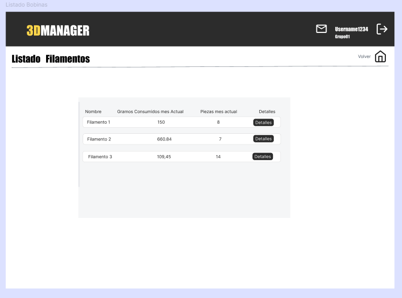
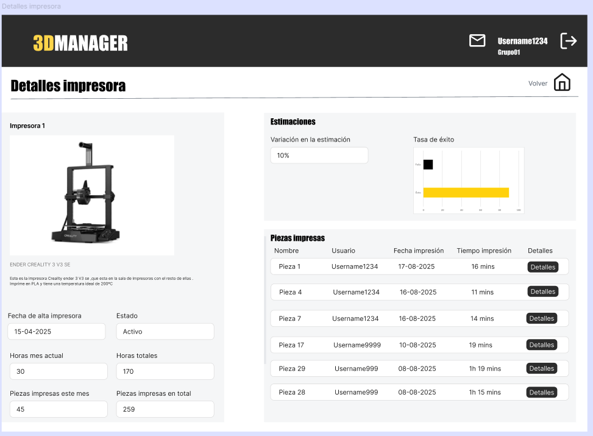

# 2025-3DManager
## Author and Supervisor

**Author:** Ismael Vicente Rodriguez  

**Email:** [i.vicenter.2018@alumnos.urjc.es](mailto:i.vicenter.2018@alumnos.urjc.es)

**Supervisor:** Michel Maes Bermejo  

**Email:** [michel.maes@urjc.es](mailto:michel.maes@urjc.es)

## Introduction

This web application is being developed as part of my final degree project for the Double Degree in Computer Engineering and Computer Science Engineering.

The developed web application aims to provide a comprehensive management platform for 3D printers and the materials used in the printing process.
Within this platform, users will share a common workspace as part of a group, where they can upload 3dPrints, comment on other members’ projects, and actively collaborate.
In addition, the system will deliver detailed insights on material usage and estimated printing times, ensuring efficient inventory tracking and production management within the group.
Ultimately, the goal is to centralize collaboration, monitoring, and optimization of 3D printing processes in a single, unified solution.

A common use case is the application for managing the resources of a 3D printing shop. In this scenario, a group is created to centralize the administration of the shop’s resources and maintain accurate inventory control. This includes monitoring printer usage time, tracking filament and material consumption, as well as recording 3dPrints and the resources utilized, whether in terms of time or supplies.

> At this stage, only the functional and technical objectives of the application have been defined. The development process has not yet started.

## Progress
**Current Phase** : 1
### Grant Diagram

## Methodology
The project is developed in phases, structured as follows:

| Phase | Description | StartDate | EndDate | Deadline |
|-------|-------------|-----------|---------|----------|
| Phase 1 | Definition of functionalities and screens |September 01 |September 14 | September 15 |
| Phase 2 | Repository, testing, and CI | | | October 15 |
| Phase 3 | Version 0.1 - Basic functionality and Docker | | | December 15 |
| Phase 4 | Version 0.2 - Intermediate functionality | | | March 1 |
| Phase 5 | Version 1.0 - Advanced functionality | | | April 15 |
| Phase 6 | Report | | | May 15 |
| Phase 7 | Defense | | | June 15 |

### Phase Details

- **Phase 1 - Definition of functionalities and screens:** In this phase, the web functionalities and interaction design (screens, transitions, etc.) will be defined. Functionality will be differentiated according to user roles (guest, registered user, and administrator).
  
- **Phase 2 - Repository, testing, and CI:** The Git repository, client and server projects will be created, and minimal functionality to connect client, server, and database will be implemented. Minimal automated tests will be set up, and the CI system configured.

- **Phase 3 - Basic functionality and Docker:** Functionality will be extended to the basic features (with corresponding automated tests) and the application will be packaged in Docker. Continuous delivery will be added. Version 0.1 of the application will be released.

- **Phase 4 - Intermediate functionality:** Functionality will be extended to the intermediate features (with corresponding automated tests) and version 0.2 will be released. The application will also be deployed in this phase.

- **Phase 5 - Advanced functionality:** The application will be finalized and version 1.0 released.

- **Phase 6 - Report:** The first draft of the final report will be prepared.

- **Phase 7 - Defense:** The final project defense will take place.

## Objectives
### Functional Objectives
- Create users and allow registration with different roles and permissions.
- Implement CRUD operations for the entities: printers, filaments, 3dPrints, and users.
- Visualize data extracted from 3D printing G-code files to provide technical insights into the printing process.
- Send notification emails to users, including alerts about comments on 3dPrints or depleted filaments.
- Estimate printing times based on the history of 3dPrints and printers.
- Display user notes for printed 3dPrints.
- Develop a comprehensive system that enables the management and control of 3D printing processes.

### Technical Objectives: Architecture and Project Technologies

#### 1. General Structure
- **Architecture:** Monolithic with REST API implemented in ASP.NET Core (.NET 8), with logical layer separation
- **Frontend:** Single Page Application (SPA) implemented in React, communicating with the backend via HTTP calls to the REST API.  
- **Database:** MySQL, using stored procedures for all SQL logic.

#### 2. Detailed Technologies
| Layer / Component | Technology / Tool | Notes |
|------------------|-----------------|-------|
| Backend (REST API) | ASP.NET Core Web API (.NET 8) | Controllers, BLL, and DAL(ADO.NET + stored procedures) organized in layers with clear separation of responsibilities |
| Frontend (SPA) | React | Communicates with backend via fetch or Axios, interactive and dynamic UI design |
| Database | MySQL | Stored procedures, initialization scripts, and sample data |
| Automated Testing | XUnit (backend), Selenium (UI) | Validation of main functionalities and API endpoints |
| API Documentation | Swagger/Postman | Interactive documentation with Swagger, Postman collection for interactive and exportable testing.|
| CI/CD | GitHub Actions | Build, test, and automatic deployment pipeline to Azure |
| Deployment | Azure App Service / Docker Container | Deploy backend and frontend, scalable and ready for load testing |
| Repository | GitHub |Version control |

#### 3. Data Flow
1. The user interacts with the React frontend.  
2. React makes HTTPS calls to the ASP.NET Core backend.  
3. The API calls the BLL to process business logic.  
4. The BLL calls the DAL, which executes stored procedures in MySQL via ADO.NET.  
5. Results are returned to the BLL, then to the API, and finally to the frontend to display data or reports.
   
## Functionalities 

### User
#### Create user
A user is able to register in the application and create an account. 
- Scope: Basic  
- Users: All  

#### Log in as user
A user is able to access the application with credentials, enabling access to group resources. 
- Scope: Basic  
- Users: Base user, Manager  

#### Log in as guest
A guest user is able to access the application in demo mode with mock data, allowing basic navigation to test the application.  
- Scope: Basic  
- Users: Guest  

---

### Group

#### Create group
A user is able to create a new group that includes users, printers, filaments, and 3D prints.
- Scope: Basic  
- Users: Base user  

#### Edit a group
A user is able to edit the details of an existing group.
- Scope: Basic
- Users: Manager

#### Delete a group
A user is able to delete an existing group.
- Scope: Basic
- Users: Manager

#### Join a group
A user is able to join an existing group.
- Scope: Basic  
- Users: Base user  

#### Leave a group
A user is able to leave a group. Their resources are no longer shown in listings but remain available in history and estimations.  
- Scope: Intermediate  
- Users: Base user  

#### Transfer management
A user is able to transfer their manager role to another user in the group.
- Scope: Intermediate  
- Users: Manager  

---

### Dashboard

#### Retrieve general data
A user is able to view a summary with aggregated printing metrics, including hours, 3DPrints, and material.
- Scope: Basic  
- Users: All  

#### Retrieve group data for pop-up
A user is able to quickly view group statistics in pop-up windows. 
- Scope: Intermediate  
- Users: All  

#### Upload 3dPrint
A user is able to upload a GCODE file and generate a new 3D print in the system with its metrics.  
- Scope: Basic  
- Users: Base user, Manager  

#### Create printer
A manager user is able to register a new printer in the group inventory. 
- Scope: Basic  
- Users: Manager  

#### Create Filament
A manager user is able to register a new filament along with its technical data. 
- Scope: Basic  
- Users: Manager  

#### Invite user to group
A manager user is able to send an invitation to another user to join the group.
- Scope: Basic–Intermediate  
- Users: Manager  

---

### Listings

#### User list
A user is able to view the users of the group. 
- Scope: Basic  
- Users: All  

#### Filaments list
A user is able to view the active filaments in the group. 
- Scope: Basic  
- Users: All  

#### 3dPrints list
A user is able to view the 3D prints associated with the group.  
- Scope: Basic  
- Users: All  

#### Notifications list (app)
A user is able to view app notifications.  
- Scope: Intermediate  
- Users: All  

#### Printer list
A user is able to view the printers associated with the group.  
- Scope: Basic  
- Users: All  

---

### Details

#### Filament details
A user is able to view complete information about a filament, including its consumption and associated 3D prints. 
- Scope: Intermediate  
- Users: All  

#### User details
A user is able to view activity metrics of a user within the group.
- Scope: Intermediate  
- Users: All  

#### Printer details
A user is able to view detailed information about a printer, including hours, 3D prints, and success rate.
- Scope: Intermediate  
- Users: All  

#### 3dPrint details
A user is able to view printing metrics, including estimated vs. actual time, material used, and printer. 
- Scope: Intermediate  
- Users: All  

#### 3D Print files
A user is able to view and download files related to a 3D print.
- Scope: Advanced
- Users: Base user, Manager

#### 3dPrint comments
A user is able to write and view comments about a 3D print in the interaction section. 
- Scope: Intermediate  
- Users: Base user, Manager  

---

### Estimations and calculations

#### Estimated real printing time based on history
A user is able to adjust predictions by comparing them with previously printed 3D prints. 
- Scope: Intermediate  
- Users: Base user, Manager  

#### Estimated time variation per printer
A user is able to adjust printing times for each printer based on its historical data. 
- Scope: Intermediate  
- Users: Base user, Manager  

#### Dashboard charts
A user is able to view visual representations of monthly usage, material consumption, and 3D prints. 
- Scope: Intermediate  
- Users: All  

#### Printer detail chart – success rate
A user is able to view a visual indicator of the percentage of successful prints. 
- Scope: Intermediate  
- Users: All  

#### Image processing
A user is able to associate and view photos of 3D prints to complement the information. 
- Scope: Intermediate  
- Users: Base user, Manager  

---

### Additional information

#### Email notification when filament is running low
A manager user is able to receive automatic notifications when a filament is nearly depleted.  
- Scope: Advanced  
- Users: Manager  

#### Email notification when receiving a comment on a 3dPrint
A user is able to receive automatic notifications when a 3D print receives a comment.  
- Scope: Advanced  
- Users: Base user, Manager  

#### Generate PDF when decommissioning a printer or filament
A user is able to view a document containing the historical data of a decommissioned resource. 
- Scope: Advanced  
- Users: Manager  

#### Generate 3D Model of a 3dPrint
A user is able to view a 3D printed model of a 3dPrint uploaded in the group. 
- Scope: Advanced  
- Users: ALL

> **Note:** It will be developed according to the workload of the corresponding phase.

## Analysis

### Screens and Navegation
An initial prototype of the application screens has been created using **Figma**.  
The prototype provides a visual overview of the different sections of the application and their interactions. **Its not the final version**

---

This diagram shows the flow between screens, illustrating how users navigate through the application.

#### Interface Summary
- **Login:** Once the user logs in:  
  - If the user belongs to a group, they are directed to the group **dashboard**.  
  - If not, they are taken to screens to **create or join a group**.  

- **Dashboard:**  
  - Displays a list of printers and access to the rest of the inventory (Filaments, 3dPrints, users).  
  - Provides general visualization of key data and metrics.  
  - For **Managers**, additional options allow adding new inventory elements or users. Selecting the entity type will navigate to the corresponding creation screen.  
 
- **Lists and Details:**  
  - From the inventory lists, users can access detailed information for each printer, filament, 3dPrint, or user.  
  - Each entity has its own dedicated details screen.  

- **Navigation:**  
  - All screens include a **button that redirects to the dashboard**, ensuring easy access to the main application area at any time.

#### Screens
- **Log In**  
  - This screen represents the entry point for users and provides access to create an account or log in as a guest if they do not have one.  
  - Users with an account are directed to the dashboard, new users or those without a group are taken to the group screens. Guests access the dashboard directly.
    

- **User Create**  
  - This screen is used to create a new user account.  
  - Once the required information is submitted, the user is directed to the group section as a new member.

- **Group**  
  - Allows viewing group invitations.  
  - Provides navigation to create a new group.

- **Create Group**  
  - Allows users to create a group via a form.  
  - Once a group is created, the user is redirected to the dashboard to start managing inventory.

- **Dashboard – Base User**  
  - Displays general data and access to main sections.  
  - Allows access to upload 3dPrints, or view lists of printers, filaments, users, and 3dPrints.

- **Dashboard – Manager**  
  - In addition to the base user functionalities, managers can access screens to **add inventory elements or users**.

- **Upload 3dPrint**  
  - Provides a form to create a new 3dPrints.  
  - From this screen, users can go to the 3dPrints detail page or return to the dashboard if they do not complete the action.

- **Upload inventory**  
  - Provides access to the uploads screens.

- **Upload Printer**  
  - Provides a form to create a new printer.  
  - Users can either return to the dashboard or, after creating a printer, navigate to its detail screen.

- **Upload filaments**  
  - Provides a form to create a new filament.  
  - Users can either return to the dashboard or navigate to the filament’s detail page after creation.

- **Invite Users**  
  - Allows inviting new users to the group.  
  - Users can only return to the dashboard from this screen.

- **Filaments List**  
  - Displays a list of filaments in the group with basic information, inviting users to view filament details.  
  - Users can navigate to the filaments details page or return to the dashboard.
   

- **User List**  
  - Displays a list of users in the group with basic information, inviting users to view user details.  
  - Users can navigate to the user details page or return to the dashboard.

- **3dPrints List**  
  - Displays a list of 3dPrints in the group with basic information, inviting users to view 3dPrint details.  
  - Users can navigate to the 3dPrint details page or return to the dashboard.

- **Filament Details**  
  - Displays details about the filament and its usage in printing.  
  - Managers can change the status (e.g., deactivate) or edit some data.  
  - Users can navigate to the list of 3dPrint printed with this filament or return to the dashboard.

- **Printer Details**  
  - Displays details about the printer and its usage.  
  - Managers can deactivate or edit printer information.  
  - Users can navigate to the list of 3dPrints printed with this printer or return to the dashboard.

- **3dPrint Details**  
  - Displays detailed information about a 3dPrint and its printing process.  
  - Some values (like printing times) can be updated.  
  - Comments on the 3dPrint can also be viewed.  
  - Users can return to the dashboard from this screen.

- **User Details**  
  - Displays detailed information about the user and their printing activity.  
  - Users can view comments related to 3dPrints.  
  - Navigation to 3dPrints printed by the user or back to the dashboard is available.

- **Log Out Pop-ups**  
  - Pop-ups that appear when the user clicks the log out button, including confirmation messages for irreversible actions.

- **Notifications**  
  - Pop-up displaying a list of short notifications that inform the user about relevant events or notifications within the application.

- **Group Details Pop-up**  
  - Provides additional information about the group, complementing the dashboard overview.

---
### Entities
This section introduces an initial diagram designed to visually support the previously described content. Its purpose is to clearly illustrate the relationships between the system’s main entities (users, groups, printers, filaments, 3dPrints, and comments) and to provide a better understanding of the application’s logical architecture.
Below is an initial diagram that complements the content and entity definitions.

#### 1.Users
Types of users:
- **Guest** → Access to the application in demo mode with mocked data. Can navigate but cannot interact with real data.  
- **Base User** → Standard user within a group. Can upload 3dPrints (GCODE & STL), check printer and filaments data, and comment on 3dPrints.  
- **Manager** → User with management permissions over the group. In addition to Base User actions, can create/remove printers, filaments, and users within the group.  

#### 2.Group
- Main organizational unit.  
- A group contains: users, printers, filaments, and 3dPrints.  
- Enables resource sharing and collaboration.  
- Each group has at least one **Manager** responsible for resource administration.  

#### 3.Printer
- Always associated with a group and linked to the 3dPrints printed on it.  
- Provides key metrics:  
  - Total printing hours.  
  - Printed 3dPrints (overall and per period).  
  - Variation between estimated and actual printing time (adjusted with history).  
- Acts as a central resource connecting production and material consumption.  

#### 4.Filament
- Represents a roll of filament material.  
- **Technical data:** filament type, color, diameter, ideal temperature, initial weight/length.  
- **Dynamic data:** remaining weight/length, printed 3dPrints using this filament, total consumption.  
- Directly linked to the 3dPrints printed with the material.  

#### 5.3dPrint (GCODE Data and STL)
- The actual production unit.  
- Generated from GCODE file analysis + user-provided data.  
- **Main information:**  
  - Estimated printing time (from slicer).  
  - Actual printing time (provided by user).  
  - Material consumption (linked filament).  
  - Printer used.  
  - Printing date.  
- Acts as the central node connecting printers, filaments, and users.  

#### 6.Comment
- Provides the **social/collaborative layer** over printed 3dPrints.  
- Always associated with a 3dPrint.  
- Facilitates feedback, recommendations, and discussions about printing results.
---
### Users 
#### 1.Guest User
- No registration required.  
- Accesses the application in demo mode with mocked (fictitious) data.  
- Can navigate through the main sections (dashboard, printers, filaments, 3dPrints) to get an approximate user experience.  
- Cannot upload GCODE files, save data, or perform actions on real resources.  

#### 2.Base User
- Member of a group (organization).  
- Can navigate through all sections of their group: printers, filaments, 3dPrints, and comments.  
- Upload GCODE files → automatic extraction of printing data.  
- View personal and group metrics (printed hours, material consumption, produced 3dPrints).  
- Check the status of printers and filaments associated with the group.  
- Add comments on already printed 3dPrints.  

Does **not** have management permissions over the inventory or other users.  

#### 3.Manager User
- Administrator of the group. **Is the owner of the group** 
- Has the same permissions as a Base User (upload 3dPrints, check data, comment).  
- Additionally, has resource management functionalities:  
  - Add/remove printers.  
  - Add/remove filaments.  
  - Add/remove users within the group.
---
### Images and graphics
#### Entity Images
Each main entity **filaments, printers, 3dPrints, and users** will be represented by a image or icon.  
These visual representations serve for quick identification between users and they can instantly recognize the type of entity they are interacting with.  

#### Graphs and Charts
Visualizations will play a key role in making the system’s data more understandable and actionable. Initial implementations include:

- **General Dashboard:** A circular (pie) chart will display the total printing hours of each printer in the group. This allows managers and users to quickly assess the workload distribution among printers.  
- **Printer Details:** Each printer will feature a bar chart showing its success rate over time, providing immediate insight into reliability, and potential areas for maintenance or improvement.

---
#### Algorithms
The application will implement several algorithms to provide automatic calculations and estimations for 3D printing processes:

1. **Printer Success Rate**  
   Calculates the success rate of a printer based on the 3dPrints it prints and their status, automatically assessing performance.

2. **Estimated Printing Time**  
   Automatically estimates the actual time required to complete a 3dPrint, based on historical printing data and trends.

3. **Filament Material Estimation**  
   Estimates the remaining material on a filament according to its usage in the application, allowing better inventory management.

4. **3dPrint Cost Estimation**  
   Calculates the estimated cost of a printed 3dPrint based on the material consumed from the filament used.

These algorithms aim to provide **automated insights**, help optimize resource usage, and assist users in planning and managing 3D printing tasks more efficiently.
